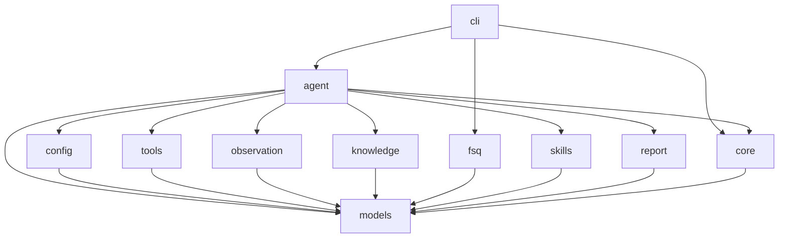

# fsq-agent Project Guide

This repository uses spec-driven development. Implementation must not start until the relevant module SPEC files are reviewed and confirmed.

## Module Table

| Module | SPEC | Purpose |
|---|---|---|
| models | fsq_agent/models/SPEC.md | Owns shared domain models, result types, and exceptions. |
| config | fsq_agent/config/SPEC.md | Loads and validates runtime configuration. |
| tools | fsq_agent/tools/SPEC.md | Provides MCP, CLI, and file operation adapters behind a common capability interface. |
| observation | fsq_agent/observation/SPEC.md | Persists run event timelines; screenshots and UI trees come only from configured MCP/tools. |
| knowledge | fsq_agent/knowledge/SPEC.md | Loads private element history and application knowledge. |
| fsq | fsq_agent/fsq/SPEC.md | Loads FSQ AI Test DSL YAML cases and converts them into agent tasks. |
| skills | fsq_agent/skills/SPEC.md | Loads automation skill instruction bundles and skill file metadata. |
| report | fsq_agent/report/SPEC.md | Generates task reports and evidence manifests. |
| core | fsq_agent/core/SPEC.md | Defines shared execution-core orchestration boundaries, StepRunner protocol, harness interface, and evidence coordination. |
| agent | fsq_agent/agent/SPEC.md | Orchestrates planning, execution, verification, retry, and report generation. |
| cli | fsq_agent/cli/SPEC.md | Exposes command line workflows for running tasks and inspecting capabilities. |

## Architecture Diagram

## Development Rules

- Each module exposes public symbols only from `__init__.py` using explicit `__all__`.
- Internal implementation files are prefixed with `_`.
- Shared data structures and exceptions live only in the `models` module.
- Module imports must follow the DAG in the architecture diagram.
- Public interface changes require SPEC update and user confirmation before implementation.
