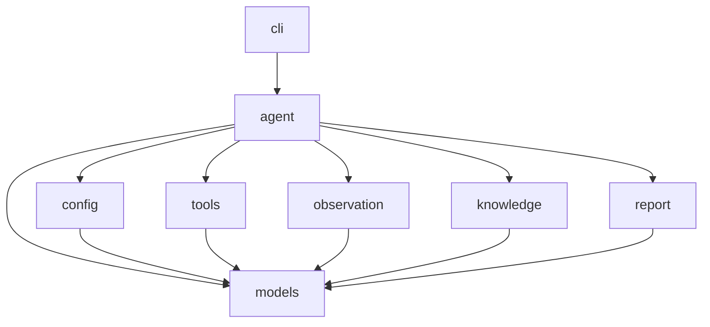

# Auto Test Agent Project Guide

This repository uses spec-driven development. Implementation must not start until the relevant module SPEC files are reviewed and confirmed.

## Module Table

| Module | SPEC | Purpose |
|---|---|---|
| models | src/auto_test_agent/models/SPEC.md | Owns shared domain models, result types, and exceptions. |
| config | src/auto_test_agent/config/SPEC.md | Loads and validates runtime configuration. |
| tools | src/auto_test_agent/tools/SPEC.md | Provides MCP, CLI, and file operation adapters behind a common capability interface. |
| observation | src/auto_test_agent/observation/SPEC.md | Captures screenshots, UI trees, logs, and traces after each execution step. |
| knowledge | src/auto_test_agent/knowledge/SPEC.md | Loads private element history, application knowledge, and flow templates. |
| report | src/auto_test_agent/report/SPEC.md | Generates task reports and evidence manifests. |
| agent | src/auto_test_agent/agent/SPEC.md | Orchestrates planning, execution, verification, retry, and report generation. |
| cli | src/auto_test_agent/cli/SPEC.md | Exposes command line workflows for running tasks and inspecting capabilities. |

## Architecture Diagram

## Development Rules

- Each module exposes public symbols only from `__init__.py` using explicit `__all__`.
- Internal implementation files are prefixed with `_`.
- Shared data structures and exceptions live only in the `models` module.
- Module imports must follow the DAG in the architecture diagram.
- Public interface changes require SPEC update and user confirmation before implementation.
