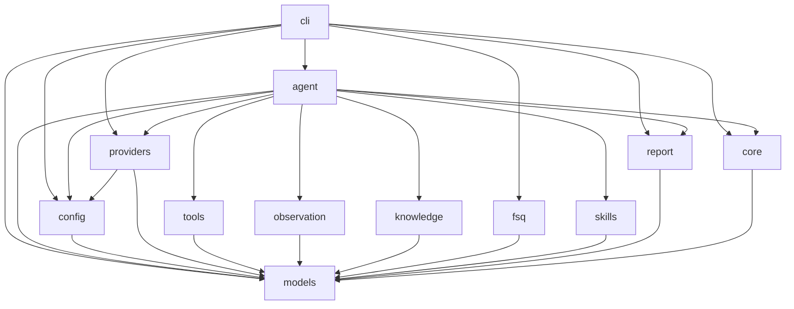

# fsq-agent Project Specification

This repository uses spec-driven development. Root `SPEC.md` is the project-level specification and module navigation source of truth. Each module also owns a module-level `SPEC.md`.

## Spec-Driven Development Workflow

For non-trivial development:

1. Clarify requirements and produce a design document.
2. Update or create relevant module `SPEC.md` files from that design.
3. Get `SPEC.md` confirmation before implementation.
4. Implement only against confirmed `SPEC.md`.
5. If implementation reveals missing design, stop and update `SPEC.md` first.
6. Before claiming completion, run independent diff-based SPEC implementation audit.

Bug fixes that do not change public interfaces or intended behavior may skip the design document, but must still read relevant `SPEC.md` files and verify that the specs remain accurate.

## Recorded Strict Case Artifacts

Dynamic LLM runs may optionally record the actual successful replayable execution trace as a generated strict FSQ `.codex.yaml` artifact under the run output directory. Recording is a CLI-owned post-run behavior: the agent runtime persists events, while the CLI recorder converts replayable harness actions plus supported CommonTool dependencies into a strict candidate case. Generated cases must never mutate source cases or `cases.dir`, and runtime secret values must never be written to YAML, manifests, events, or reports.

Recorded strict cases may contain replay-only syntax such as `runtimeSecret` parameter references and `waitMs` pure-wait commands. Strict execution resolves `runtimeSecret` references in memory before UI actions begin and executes `waitMs` without platform driver side effects.

## Dynamic LLM Pre-Plan and Goal Verification

Dynamic LLM `--goal`, `--case-yaml`, and `--case-dir` runs use pre-plan as the input-understanding boundary before external UI actions begin. The pre-planner must produce structured ordered `key_actions` for the main execution loop and one `verification_goal` string for final evidence-based verification. Dynamic final verification is goal-only and has no user-configurable `verification.mode`.

Dynamic LLM `--case-yaml` and `--case-dir` runs read authored case files as raw UTF-8 reference text, not as strict executable steps. The CLI-owned dynamic task construction must preserve that full raw reference in explicit planning-reference fields. Raw YAML steps are advisory only for dynamic LLM execution: they may help infer an execution flow, but they are not assumed accurate and must not be transformed into local executable steps or final verifier requirements. For raw cases, pre-plan should prefer case-level intent signals such as name, metadata, tags, properties, and human-authored goal text when summarizing `verification_goal`; step content may provide supporting context when the case-level intent is incomplete or ambiguous. Dynamic recording continues to reconstruct replayable commands only from actual run events.

## Module Table

| Module | SPEC | Purpose |
|---|---|---|
| models | fsq_agent/models/SPEC.md | Owns shared domain models, result types, replay reference models, and exceptions. |
| config | fsq_agent/config/SPEC.md | Loads and validates runtime, provider, harness/driver, strict-core, strict replay secret, common tool, and workspace configuration. |
| providers | fsq_agent/providers/SPEC.md | Builds shared Azure OpenAI and GitHub Copilot provider sessions for agent runs, verifier/pre-planner calls, and provider-backed AI assertion evaluators. |
| tools | fsq_agent/tools/SPEC.md | Provides SDK-neutral CommonTool capabilities, recordable wait/runtime-secret metadata, and the OpenAI Agents SDK adapter for file, artifact, wait, and allowlisted runtime-secret utilities. |
| observation | fsq_agent/observation/SPEC.md | Persists run event timelines; screenshots, UI trees, and other observations are represented by harness or CommonTool artifact refs. |
| knowledge | fsq_agent/knowledge/SPEC.md | Loads private element history and application knowledge. |
| fsq | fsq_agent/fsq/SPEC.md | Loads FSQ AI Test DSL YAML cases, validates replay references, and converts parsed cases into deterministic strict-core executable steps. |
| skills | fsq_agent/skills/SPEC.md | Loads automation skill instruction bundles and skill file metadata. |
| report | fsq_agent/report/SPEC.md | Generates LLM task reports, strict-core evidence reports, and resolves stored reports by run id. |
| core | fsq_agent/core/SPEC.md | Defines shared execution-core orchestration boundaries, StepRunner protocol, pure waits, harness interface, and evidence coordination. |
| agent | fsq_agent/agent/SPEC.md | Orchestrates dynamic goal/reference execution through OpenAI Agents SDK, verification, replayable event metadata, and report generation. |
| cli | fsq_agent/cli/SPEC.md | Exposes the public `init`, `run`, `report`, strict replay, and dynamic-run recording workflows. |

## Architecture Diagram

## Development Rules

- Each module exposes public symbols only from `__init__.py` using explicit `__all__`.
- Internal implementation files are prefixed with `_`.
- Shared data structures and exceptions live only in the `models` module.
- Module imports must follow the DAG in the architecture diagram.
- Provider construction lives in `providers`; `core` must use provider-neutral protocols and must not import provider/runtime modules.
- Cross-platform local utilities live behind the CommonTool interface in `tools`; platform actions and AI assertions belong to harnesses.
- Public interface changes require `SPEC.md` update and user confirmation before implementation.
- `CLAUDE.md` and `AGENTS.md` are agent entry points only. They must point to this root `SPEC.md` and must not duplicate project specification content.
