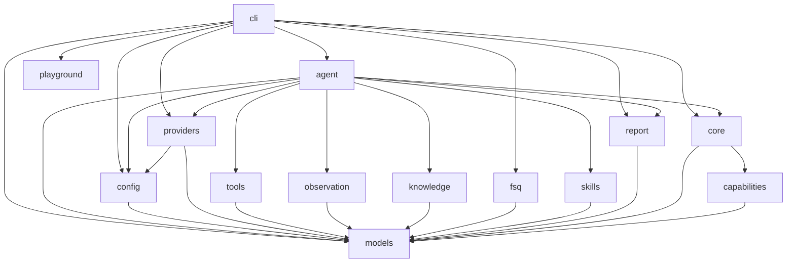

# fsq-agent Project Specification

This repository uses spec-driven development. Root `SPEC.md` is the project-level specification and module navigation source of truth. Each module also owns a module-level `SPEC.md`.

## Spec-Driven Development Workflow

For non-trivial development:

1. Clarify requirements and produce a design document.
2. Update or create relevant module `SPEC.md` files from that design.
3. Get `SPEC.md` confirmation before implementation.
4. Implement only against confirmed `SPEC.md`.
5. If implementation reveals missing design, stop and update `SPEC.md` first.
6. Before claiming completion, run independent diff-based SPEC implementation audit.

Bug fixes that do not change public interfaces or intended behavior may skip the design document, but must still read relevant `SPEC.md` files and verify that the specs remain accurate.

## Tool And Capability Execution

fsq-agent separates dynamic-only helper tools from recordable execution capabilities.

- AgentTools are OpenAI Agents SDK helper tools used only during dynamic execution. They include scoped file reads/writes and bounded run-artifact search/slice helpers. AgentTools are not strict replay capabilities, are not registered in FSQ capability registries, and are never recorded into generated strict YAML.
- CommonTools are recordable platform-default execution capabilities inherited by every active platform. In this SPEC cycle they are `wait_ms`/`waitMs` and `get_runtime_secret`/`runtimeSecret` dependency metadata.
- PlatformTools are recordable active-platform capabilities. They include concrete backend driver actions, including backend-owned assertions such as `assert_with_ai`.

All recordable execution behavior is declared through decorator-driven capability metadata. The neutral `capabilities` module owns shared declaration decorators, catalog-backed platform validation, and reflection/discovery helpers that produce `models.CapabilityDefinition` records for CommonTools and PlatformTools. The capability registry is the source of truth for canonical names, aliases, parameter schemas, tool family, replay policy, sensitivity, evidence policy, platform/backend ownership, and provenance.

Decorator unification is a declaration-layer concern, not an AgentTool merge. AgentTools remain dynamic-only helper behavior owned by `tools`; CommonTool and PlatformTool capabilities are owned by `core`. CommonTool bodies live in platform tool providers, while backend-specific PlatformTool bodies live on concrete backend drivers. Concrete harness classes such as `AndroidHarness` and `WebHarness` remain runner-facing runtime gateways and services, but they must not own individual tool bodies such as `assert_with_ai`.

`StepRunner` is the common execution manager for CommonTool and PlatformTool capabilities. It looks up the capability registry, validates params, applies evidence, post-action delay, and sensitivity policy, emits structured safe events, and invokes recordable capabilities through `HarnessInterface.invoke_action(step, context)`. Harness implementations route CommonTools to inherited platform tool providers and driver-backed PlatformTools to concrete backend drivers while supplying runtime services such as context, artifact capture, evaluator injection, driver access, settings, and error classification. For PlatformTools with `CapabilityDefinition.capture_evidence=True`, a default step evidence policy resolves to the standard screenshot plus active platform observation capture policy before the action, after the action, and on failure; Android uses `ui_tree`, and Web uses `page_snapshot`. Explicit non-default `ExecutableStep.evidence_policy` values remain caller overrides. For every capability, the effective post-action delay resolves from `CapabilityDefinition.post_action_delay_seconds` when set, otherwise from configured `execution.post_action_delay_seconds` defaults for CommonTool or PlatformTool capabilities. A positive delay is execution timing only, occurs after invoke and before finalize/after-action/failure evidence capture, and must not create synthetic `waitMs` commands, evidence steps, replay commands, or action results. Executable paths must not branch on names such as `waitMs`, `wait_ms`, `get_runtime_secret`, Android command names, or Web command names.

Capability registry bootstrap is platform-selected. Entry layers register the active platform's inherited CommonTool capabilities plus only the configured platform's PlatformTool capability set. Android and Web PlatformTools must not be registered together in the default runtime registry, so each platform can expose native canonical names and replay aliases without cross-platform ambiguity. AgentTools are exposed only to dynamic SDK agents and are excluded from strict replay registries.

## Recorded Strict Case Artifacts

Dynamic LLM runs may optionally record the actual successful replayable execution trace as a generated strict FSQ `.codex.yaml` artifact under the run output directory. Recording is a CLI-owned post-run behavior: the agent runtime persists normalized capability events, while the CLI recorder converts replayable capability results into a strict candidate case according to `ReplayPolicy` metadata. Generated cases must never mutate source cases or `cases.dir`, and runtime secret values must never be written to YAML, manifests, events, or reports.

Recorded strict cases may contain replay-only syntax such as `runtimeSecret` parameter references and `waitMs` aliases. Strict execution bootstraps the active platform capability registry before YAML parsing, resolves `runtimeSecret` references in memory before external actions begin, and resolves `waitMs` through the registry to the inherited `wait_ms` CommonTool capability.

Recorded Web lifecycle commands are ordinary replayable capability results when the dynamic run actually executed `startBrowser` or `closeBrowser`. The recorder must not invent browser lifecycle commands as cleanup or setup guesses.

## Dynamic LLM Pre-Plan and Goal Verification

Dynamic LLM `--goal`, `--case-yaml`, and `--case-dir` runs use pre-plan as the input-understanding boundary before external UI actions begin. The pre-planner must produce structured ordered `key_actions` for the main execution loop and one `verification_goal` string for final evidence-based verification. Dynamic final verification is goal-only and has no user-configurable `verification.mode`.

Dynamic LLM `--case-yaml` and `--case-dir` runs read authored case files as raw UTF-8 reference text, not as strict executable steps. The CLI-owned dynamic task construction must preserve that full raw reference in explicit planning-reference fields. Raw YAML steps are advisory only for dynamic LLM execution: they may help infer an execution flow, but they are not assumed accurate and must not be transformed into local executable steps or final verifier requirements. For raw cases, pre-plan should prefer case-level intent signals such as name, metadata, tags, properties, and human-authored goal text when summarizing `verification_goal`; step content may provide supporting context when the case-level intent is incomplete or ambiguous. Dynamic recording continues to reconstruct replayable commands only from actual run events.

## Runtime Configuration Defaults

Default local LLM runs use GitHub Copilot provider authentication with Copilot model `gpt-5.5` and tracing enabled. Azure OpenAI remains available only when config explicitly selects `openai_agents.provider: azure_openai`; Azure endpoint, deployment/model, and API key values come from fixed environment variable names rather than YAML fields. Local user values such as Android app id, Android device serial, account secrets, and Azure provider values belong in process environment or `.env`. YAML config owns developer policy and runtime shape such as provider selection, tracing default, harness platform/backend, Web browser/base URL settings, execution post-action delay defaults, runtime secret allowlist, agent context knowledge-root resources, workspace root, cases root, and output root.

## Platform Blocks

Shared platform rules:

- `harness.platform` selects exactly one active platform for normal dynamic, strict, and playground execution.
- Entry layers build a platform-selected capability registry: inherited CommonTool capabilities plus only the active platform's PlatformTool capabilities.
- `StepRunner`, `StepSequenceRunner`, evidence, recording, report generation, and FSQ parsing stay platform-neutral and consume capability metadata rather than platform action-name branches.
- Platform-specific behavior belongs in platform parameter models, action catalogs, harnesses, drivers, config blocks, and configured skill Markdown.

Android platform block:

- Platform id: `android`.
- First backend: `uiautomator2`.
- Local app/device values come from `FSQ_ANDROID_APP_ID` and `FSQ_ANDROID_SERIAL` or strict FSQ case metadata where allowed.
- Observation artifact: `ui_tree` with alias `uiTree`.
- Harness skill: `android-harness.md`.

Web platform block:

- Platform id: `web`.
- First backend: `playwright`.
- Runtime settings include browser channel, environment-backed browser executable path, headless mode, optional base URL, and optional viewport fields when specified by module specs.
- Browser lifecycle is explicit through `start_browser`/`startBrowser` and `close_browser`/`closeBrowser`. Runtime, CLI, FSQ parsing, StepRunner, StepSequenceRunner, and playground entry paths must not auto-inject lifecycle commands or launch a browser as a driver-construction side effect.
- `startBrowser` is idempotent and reuses the active browser/page when one is already started. `closeBrowser` is idempotent, closes the active browser/page when present, resets driver-owned state, and permits a later `startBrowser` in the same task.
- Web page-dependent actions, including `navigateTo`, require an active browser/page and must fail clearly when invoked before `startBrowser`; `navigateTo` must not implicitly start the browser.
- Observation artifact: `page_snapshot` with alias `pageSnapshot`; Web must not expose Android `ui_tree`/`uiTree` naming.
- First-batch action surface follows Playwright MCP core automation semantics: snapshot-first targets, semantic actions, screenshots as observation/evidence, and unsafe/opt-in capability families deferred to later SPEC-reviewed groups.
- Harness skill: `web-harness.md`.

Future platform block:

- New platforms must add their own module SPEC sections before implementation.
- New platforms must reuse shared capability declaration/registry contracts, provide platform-selected default capability definitions, add platform-specific skill guidance, and keep runner/report/recording behavior metadata-driven.

## Prompt Context Boundaries

Dynamic LLM prompt context has four distinct channels. `agent_instructions.j2` owns stable dynamic execution rules. `task_input.j2` owns one task's structured input, ordered key actions, and final `verification_goal`. `knowledge/project.md` owns tested-project-specific guidance loaded for normal dynamic execution. Configured skills under the knowledge root own composable execution guidance such as platform and harness rules. There is no separate custom-instruction configuration channel; ad hoc operator guidance must be represented as project knowledge or configured skills.

Loader diagnostics such as missing optional skills or missing optional knowledge references are operational signals and must not be rendered into model-facing prompts. Required skill failures remain fail-fast. Optional broken skills are skipped with operator-visible diagnostics and are not passed to the LLM as warning-only or partial guidance. Runtime Markdown knowledge and skill content should stay concise, current, and aligned with exposed AgentTool, CommonTool, and PlatformTool surfaces.

## Module Table

| Module | SPEC | Purpose |
|---|---|---|
| models | fsq_agent/models/SPEC.md | Owns shared domain models, capability metadata/registry contracts, invocation/result contracts, replay reference models, and exceptions. |
| capabilities | fsq_agent/capabilities/SPEC.md | Owns neutral capability declaration decorators, catalog-backed platform action validation, and metadata discovery helpers used by `core` recordable capabilities. |
| config | fsq_agent/config/SPEC.md | Loads and validates env/YAML runtime, provider, harness/driver/platform-tool, tracing, execution post-action delay, strict replay secret, agent context, AgentTool output, CommonTool secret, and workspace configuration. |
| providers | fsq_agent/providers/SPEC.md | Builds shared Azure OpenAI and GitHub Copilot provider sessions for agent runs, verifier/pre-planner calls, and provider-backed AI assertion evaluators. |
| tools | fsq_agent/tools/SPEC.md | Provides dynamic-only AgentTool providers, scoped file helpers, bounded artifact lookup helpers, and the OpenAI Agents SDK AgentTool adapter. |
| observation | fsq_agent/observation/SPEC.md | Persists run event timelines; screenshots, UI trees, and other observations are represented by platform evidence artifacts or AgentTool artifact refs. |
| knowledge | fsq_agent/knowledge/SPEC.md | Loads project-specific application knowledge and task-referenced knowledge assets. |
| fsq | fsq_agent/fsq/SPEC.md | Loads FSQ AI Test DSL YAML cases, resolves authored action aliases through the capability registry, validates replay references, and converts parsed cases into canonical deterministic executable steps. |
| skills | fsq_agent/skills/SPEC.md | Loads complete configured automation skill instruction bundles and skips or fails broken bundles according to requiredness. |
| report | fsq_agent/report/SPEC.md | Generates LLM task reports, strict-core evidence reports, reconstructs tool calls from structured capability metadata, and resolves stored reports by run id. |
| core | fsq_agent/core/SPEC.md | Defines the shared `StepRunner` execution manager, CommonTool/PlatformTool providers, Android/Web harness and driver interfaces, concrete platform backends, and evidence coordination. |
| agent | fsq_agent/agent/SPEC.md | Orchestrates dynamic goal/reference execution through OpenAI Agents SDK, AgentTool exposure, active-platform capability exposure, verification, replayable event metadata, and report generation. |
| playground | fsq_agent/playground/SPEC.md | Serves the local browser playground for active-platform runtime status, Android session setup where applicable, dynamic goal/raw-case execution, strict YAML execution, screenshots, replay video preview, and report lookup. |
| cli | fsq_agent/cli/SPEC.md | Exposes the public `init`, `run`, `report`, `playground`, capability registry bootstrap, strict replay, dynamic-run recording, and local playground workflows. |

## Architecture Diagram

## Development Rules

- Each module exposes public symbols only from `__init__.py` using explicit `__all__`.
- Internal implementation files are prefixed with `_`.
- Shared data structures and exceptions live only in the `models` module. Capability declaration decorators, catalog-backed platform validation, and decorated-method discovery live only in the `capabilities` module.
- Module imports must follow the DAG in the architecture diagram.
- Package-private composition helpers at the `fsq_agent` package root may compose public module APIs for shared entry-layer bootstrap. They must remain private, must not expose public module contracts, and must not be imported by `models`, `capabilities`, `tools`, `fsq`, `core`, `providers`, or `report`.
- `capabilities` may import `models` only among project modules. It must not import `tools`, `core`, `agent`, `cli`, `fsq`, `providers`, `report`, `playground`, SDK objects, concrete drivers, or backend runtime types.
- Provider construction lives in `providers`; `core` must use provider-neutral protocols and must not import provider/runtime modules.
- Dynamic-only local helper utilities live as AgentTools in `tools`; recordable CommonTool and PlatformTool capabilities live in `core`, with CommonTool bodies in platform tool providers and backend PlatformTool bodies on concrete drivers. CommonTools and PlatformTools declare executable metadata through `capabilities`. All recordable capabilities must be registered before strict YAML parsing or SDK capability exposure, and platform registries must contain only inherited CommonTools plus the active platform's PlatformTools. AgentTools must not be registered for strict replay.
- Replay, sensitivity, evidence, and tool-origin behavior must come from capability metadata and normalized `StepRunner` results, not hard-coded tool-name sets.
- Public interface changes require `SPEC.md` update and user confirmation before implementation.
- `CLAUDE.md` and `AGENTS.md` are agent entry points only. They must point to this root `SPEC.md` and must not duplicate project specification content.

## Python Architecture Rules

- Use the lowest architecture level that keeps the module clear, testable, and changeable.
- `models`, `capabilities`, `tools`, `fsq`, `report`, `knowledge`, `skills`, `config`, `providers`, and `observation` default to Level 2 Simple Package unless a module SPEC records a stronger need.
- `core`, `agent`, `cli`, and `playground` use Level 3 Layered Application because they coordinate execution flows, external SDKs, harnesses, providers, persistence, HTTP entry points, and user entry points.
- Public APIs must be exported from module `__init__.py` files, and internal implementation modules must remain private across module boundaries.
- Do not introduce Repository, Unit of Work, Clean Architecture, or DDD patterns unless a confirmed SPEC records the concrete reason.
