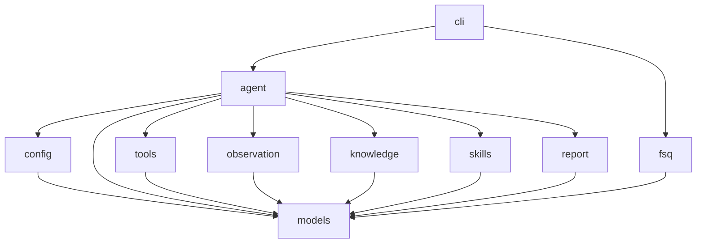

# fsq-agent Project Specification

This repository uses spec-driven development. Root `SPEC.md` is the project-level specification and module navigation source of truth. Each module also owns a module-level `SPEC.md`.

## Spec-Driven Development Workflow

For non-trivial development:

1. Clarify requirements and produce a design document.
2. Update or create relevant module `SPEC.md` files from that design.
3. Get `SPEC.md` confirmation before implementation.
4. Implement only against confirmed `SPEC.md`.
5. If implementation reveals missing design, stop and update `SPEC.md` first.
6. Before claiming completion, run independent diff-based SPEC implementation audit.

Bug fixes that do not change public interfaces or intended behavior may skip the design document, but must still read relevant `SPEC.md` files and verify that the specs remain accurate.

## Module Table

| Module | SPEC | Purpose |
|---|---|---|
| models | fsq_agent/models/SPEC.md | Owns shared domain models, result types, and exceptions. |
| config | fsq_agent/config/SPEC.md | Loads and validates runtime configuration. |
| tools | fsq_agent/tools/SPEC.md | Provides harness/platform action adapters, MCP integrations, CLI tools, and file operation adapters behind common capability interfaces. |
| observation | fsq_agent/observation/SPEC.md | Persists run event timelines; screenshots and UI trees come only from configured harness/platform actions or tools. |
| knowledge | fsq_agent/knowledge/SPEC.md | Loads private element history and application knowledge. |
| fsq | fsq_agent/fsq/SPEC.md | Loads FSQ AI Test DSL YAML cases and converts them into agent tasks. |
| skills | fsq_agent/skills/SPEC.md | Loads automation skill instruction bundles and skill file metadata. |
| report | fsq_agent/report/SPEC.md | Generates task reports and evidence manifests. |
| agent | fsq_agent/agent/SPEC.md | Orchestrates planning, execution, verification, retry, and report generation. |
| cli | fsq_agent/cli/SPEC.md | Exposes command line workflows for running tasks and inspecting capabilities. |

## Architecture Diagram

## Development Rules

- Each module exposes public symbols only from `__init__.py` using explicit `__all__`.
- Internal implementation files are prefixed with `_`.
- Shared data structures and exceptions live only in the `models` module.
- Module imports must follow the DAG in the architecture diagram.
- Public interface changes require `SPEC.md` update and user confirmation before implementation.
- `CLAUDE.md` and `AGENTS.md` are agent entry points only. They must point to this root `SPEC.md` and must not duplicate project specification content.
