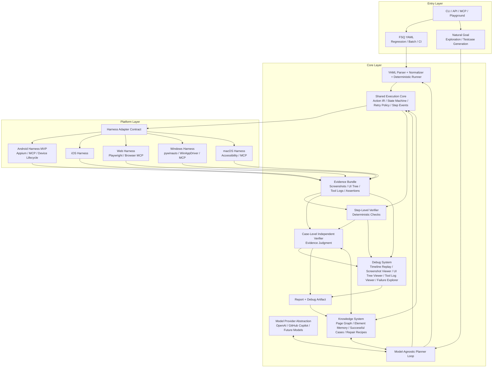
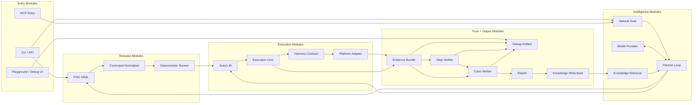
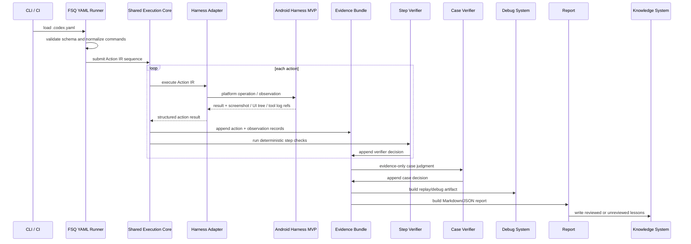
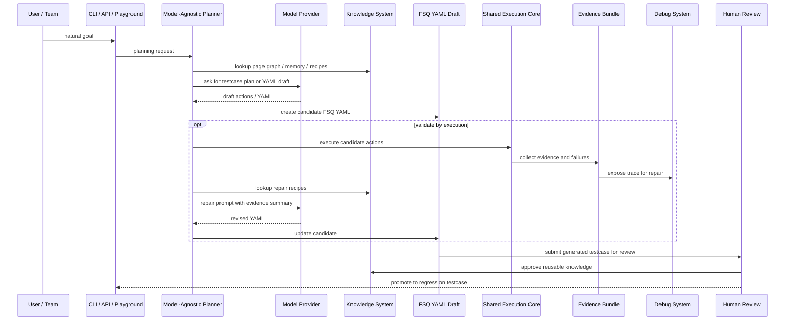
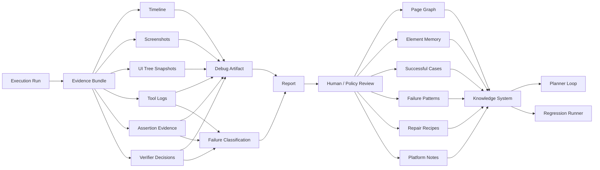

# FSQ-Agent Architecture Deep Dive

Status: team review draft
Date: 2026-06-04
Language policy: English is the contract source of truth. The Chinese section is a reading companion and must be updated with English changes.

This document expands the diagram in `docs/assets/fsq-agent-architecture-v2.png` into a team-readable architecture package. It provides layered diagrams, module maps, execution flows, and a module-by-module explanation with Midscene implementation references.

Related assets:

- `docs/assets/fsq-agent-architecture-v2.png`
- `docs/assets/fsq-agent-layered-architecture.mmd`
- `docs/assets/fsq-agent-module-map.mmd`
- `docs/assets/fsq-agent-regression-flow.mmd`
- `docs/assets/fsq-agent-exploration-flow.mmd`
- `docs/assets/fsq-agent-debug-knowledge-flow.mmd`

## 1. Layered Architecture

The key architecture choice is **Dual Loop, Shared Harness**. FSQ YAML is the regression-test path. Natural goal is the exploration and testcase-generation path. Both loops share execution, harness, evidence, verification, report, debug, and knowledge contracts.

Midscene uses a similar layered shape: entry integrations such as CLI, Playwright, Puppeteer, Chrome extension, MCP, and playground call into `packages/core`; core owns `Agent`, `TaskExecutor`, YAML `ScriptPlayer`, planning, dump, and report; platform packages provide concrete page/device interfaces.

## 2. Module Map

This map separates work into team-owned areas. A team can own FSQ YAML normalization without owning model planning. Another team can own Android harness reliability without changing report rendering.

## 3. Regression Flow

The regression flow must not depend on a planner model. This is the main difference from the current FSQ-Agent behavior, where FSQ commands are mostly converted into agent task context and ordered key actions.

## 4. Exploration Flow

Midscene's `TaskExecutor.action` is a useful reference for exploration. It loops over planning, executable conversion, action execution, feedback, and replanning. FSQ should borrow this loop shape but make durable FSQ YAML the output, rather than only completing a one-off UI task.

## 5. Debug and Knowledge Flow

Midscene's report path is a strong reference. `ReportGenerator` writes live execution dumps, manages screenshots through `ScreenshotStore`, and supports HTML report output. FSQ should keep this level of debug usefulness, but tie it to an explicit evidence bundle and independent verifier decisions.

## 6. Module Deep Dive

### 6.1 FSQ YAML: Regression / Batch / CI

FSQ role: This is the stable regression-test entry. A `.codex.yaml` case should be validatable, normalizable, executable, and reportable without natural-goal planning.

Midscene reference: Midscene YAML is handled by `packages/core/src/yaml/player.ts`. `ScriptPlayer` loads task flows and calls agent methods such as `aiAct`, `aiAssert`, `aiWaitFor`, `aiTap`, `aiScroll`, and generic action-space actions. CLI construction starts from `packages/cli/src/create-yaml-player.ts`, which parses YAML, selects target platform, creates an agent, and runs the player.

FSQ difference: Midscene YAML remains strongly AI-action oriented. FSQ YAML should become stronger as a deterministic regression artifact. The runner should reject unsupported required commands before execution and produce Action IR plus evidence records.

Team ownership: FSQ schema, parser, normalizer, deterministic command subset, batch semantics, CI exit status.

### 6.2 Natural Goal: Exploration / Testcase Generation

FSQ role: This is a separate entry for exploratory testing and testcase generation. Its durable output should be FSQ YAML or a structured testcase draft.

Midscene reference: `TaskExecutor.action` in `packages/core/src/agent/tasks.ts` implements the planning loop. It creates conversation history, calls `plan`, converts planning actions to executable tasks, executes them, feeds errors or completion back into the next planning turn, and stops when planning says the task is complete.

FSQ difference: Midscene focuses on completing the live instruction. FSQ should use similar planning mechanics, but bias the planner toward producing, validating, and repairing reusable FSQ YAML.

Team ownership: planner prompt contract, generated YAML quality, repair loop, human review handoff.

### 6.3 CLI / API / MCP / Playground

FSQ role: Entry points should be thin routing layers. They should not own platform action logic or verifier logic.

Midscene reference: Midscene CLI creates YAML players in `packages/cli/src/create-yaml-player.ts`. Web integrations expose Playwright/Puppeteer/Chrome extension entry points under `packages/web-integration/src`. MCP is represented by `packages/mcp` and newer platform-specific MCP packages referenced by `packages/mcp/src/server.ts`.

FSQ difference: FSQ should expose two clearly named workflows: regression execution from FSQ YAML, and exploration/generation from natural goal. Debug UI should open existing artifacts rather than re-run logic.

Team ownership: command UX, CI behavior, API request/response shape, MCP tool surface, local debug entry.

### 6.4 YAML Parser + Normalizer + Deterministic Runner

FSQ role: This module converts FSQ YAML into a normalized command model and then Action IR. It owns deterministic execution semantics for regression tests.

Midscene reference: Midscene `ScriptPlayer.playTask` is a practical YAML executor. It switches over flow item keys and dispatches to agent methods or action-space calls. It also keeps task status and writes results.

FSQ difference: FSQ should split parsing, normalization, and execution more explicitly. The deterministic runner should not call a general agent loop to interpret every command. AI-assisted assertions can exist, but they must bind to screenshot evidence and verifier decisions.

Team ownership: schema validation, command compatibility matrix, Action IR mapping, unsupported-command errors, YAML-to-evidence traceability.

### 6.5 Model-Agnostic Planner Loop

FSQ role: The planner decomposes natural goals, looks up knowledge, drafts YAML, optionally validates draft actions, and repairs failures.

Midscene reference: `packages/core/src/ai-model/llm-planning.ts` builds the planning prompt from screenshot context, action space, model family, conversation history, memories, and execution progress. It parses XML planning responses into structured actions, logs, memory, and completion signals.

FSQ difference: FSQ must hide provider specifics behind a provider abstraction. OpenAI and GitHub Copilot are target providers. Planner state should not depend on one provider's tool-calling dialect.

Team ownership: provider-neutral planning interface, prompt templates, repair policy, generated YAML contract, model trace redaction.

### 6.6 Model Provider Abstraction

FSQ role: This layer normalizes authentication, request/response shapes, streaming, tool support, image inputs, and usage metadata across providers.

Midscene reference: Midscene uses model configuration and `callAI` under the AI model layer. Planning dispatches to different implementations for model families such as UITars or AutoGLM from `TaskExecutor.action`.

FSQ difference: FSQ explicitly targets multiple mainstream providers, at least OpenAI and GitHub Copilot. Provider switching should not change planner contract or evidence schema.

Team ownership: provider config, auth, request adapters, response parsing, usage accounting, provider capability declarations.

### 6.7 Shared Execution Core

FSQ role: This is the execution spine shared by regression and exploration. It owns Action IR sequencing, step state, retries, timeouts, event emission, and evidence attachment.

Midscene reference: Midscene's closest concepts are `TaskExecutor`, `ExecutionSession`, `TaskBuilder`, and `TaskRunner`. `TaskExecutor` converts plans to executable tasks and coordinates planning/execution feedback.

FSQ difference: FSQ should make this core explicit and model-independent. The regression path should use it without planner calls. The exploration path should use it when validating generated steps.

Team ownership: Action IR runtime, state machine, retry policy, timeout policy, run events, execution result contract.

### 6.8 Harness Adapter Contract

FSQ role: The harness contract hides platform-specific UI operation details while preserving capability metadata and evidence quality.

Midscene reference: Midscene defines an abstract device interface in `packages/core/src/device/index.ts`, including `interfaceType`, `screenshotBase64`, `actionSpace`, and optional `getElementsNodeTree`. Web implementations such as `packages/web-integration/src/playwright/page.ts` and Puppeteer base page adapt platform APIs into this interface.

FSQ difference: FSQ harness should be more test-trust oriented. It should classify lifecycle, action, observation, timeout, and unsupported-capability failures, and it should return artifact references suitable for evidence bundles.

Team ownership: platform capability model, lifecycle hooks, action execution API, observation capture API, error taxonomy.

### 6.9 Android Harness MVP

FSQ role: Android is the first production harness target. It should manage device/app lifecycle, execute normalized actions, capture screenshot/UI tree/tool logs, and classify failures.

Midscene reference: Midscene has platform-oriented packages and device options, including Android-oriented MCP direction in package organization. The older general MCP package is deprecated in favor of platform-specific MCP packages.

FSQ difference: FSQ can use Appium MCP, direct Appium, or a hybrid adapter, but the harness contract should hide that choice from YAML runner and verifier.

Team ownership: Appium/MCP integration, device lifecycle, app lifecycle, session management, Android UI tree and screenshot capture, platform flake handling.

### 6.10 Web / iOS / Windows / macOS Harnesses

FSQ role: These adapters should implement the same harness contract after Android proves the MVP path.

Midscene reference: Midscene web integration is mature: Playwright, Puppeteer, Chrome extension, bridge mode, static page, and MCP tooling live under `packages/web-integration/src`.

FSQ difference: FSQ should avoid making web semantics the default for every platform. The contract should preserve shared concepts while letting platforms expose their own capabilities.

Team ownership: platform-specific adapters, capability discovery, locator strategy, screenshot/UI tree capture, platform-specific recovery.

### 6.11 Evidence Bundle

FSQ role: Evidence is the authoritative execution record. It should feed step verifier, case verifier, debug artifacts, reports, and knowledge write-back.

Midscene reference: Midscene uses `ExecutionDump`, `ReportActionDump`, and screenshot storage in `packages/core/src/dump/report-action-dump.ts`, `packages/core/src/report-generator.ts`, and `packages/core/src/dump/screenshot-store.ts`.

FSQ difference: FSQ should make evidence explicit as a cross-module schema. It should store references to large artifacts rather than embedding everything in memory or JSON.

Team ownership: evidence schema, artifact paths, redaction, retention policy, CI-friendly manifest.

### 6.12 Step-Level Verifier

FSQ role: Step verifier performs deterministic checks close to execution, such as action status, element existence, text equality, and assertion tool outputs.

Midscene reference: Midscene YAML `aiAssert` returns pass/thought/message and throws when assertions fail. Query/assert tasks are implemented in `TaskExecutor` via insight query tasks.

FSQ difference: FSQ should separate step-level checks from final case judgment. Step verification should be structured, evidence-bound, and deterministic where possible.

Team ownership: deterministic assertion semantics, blocking/non-blocking rules, assertion evidence binding.

### 6.13 Case-Level Independent Verifier

FSQ role: Case verifier judges the whole test from supplied evidence only. It should not trust the runner's success claim without evidence.

Midscene reference: Midscene reports execution status and assertion failures, but it does not center an independent evidence-only verifier as the final arbiter.

FSQ difference: This is a core FSQ trust feature. The case verifier may be model-assisted, but it must consume evidence bundles, not hidden execution state.

Team ownership: final judgment contract, verifier prompt or rule engine, inconclusive status, CI pass/fail mapping.

### 6.14 Debug System

FSQ role: Debug is a first-class system: timeline replay, screenshots, UI tree, tool logs, assertion evidence, verifier trace, and failure explorer.

Midscene reference: Midscene report generation is highly useful for visual debugging. `ReportGenerator.onExecutionUpdate` writes execution dumps during a run, manages screenshot output mode, and finalizes HTML report artifacts.

FSQ difference: FSQ debug should be generated from the same evidence bundle used by verification. This prevents report/debug drift from the final verdict.

Team ownership: static HTML artifact, evidence browser, timeline UX, verifier trace rendering, failure explorer.

### 6.15 Report + Debug Artifact

FSQ role: Reports serve humans and machines. Markdown/JSON remain useful for CI and IDEs; debug artifacts serve interactive investigation.

Midscene reference: Midscene report supports single HTML and HTML with external assets. It serializes dumps into script tags and stores screenshots inline or in a directory.

FSQ difference: FSQ should keep Markdown/JSON for automation and add debug artifact references. Reports should summarize evidence rather than duplicate all raw data.

Team ownership: Markdown report, JSON report, HTML debug artifact, artifact index, failure classification.

### 6.16 Knowledge System

FSQ role: Knowledge stores reusable testing experience: page graph, element memory, successful action sequences, failure patterns, repair recipes, and platform notes.

Midscene reference: Midscene planning uses conversation history and memory inside a run. `llm-planning.ts` includes memory text and historical logs in the prompt. Task cache also exists as a reuse mechanism.

FSQ difference: FSQ needs durable, team-curated knowledge across runs. Automatic write-back should be marked unreviewed until promoted.

Team ownership: knowledge schema, retrieval policy, write-back review, stale knowledge handling, repair recipes.

## 7. Recommended Team Split

| Area | Primary Ownership | Review Partners |
| --- | --- | --- |
| FSQ YAML and deterministic runner | Testcase schema team | Harness, verifier |
| Shared execution core and Action IR | Core agent team | YAML, harness, report |
| Android harness MVP | Platform team | Core, verifier |
| Evidence and verifier | Trust/reliability team | Harness, report |
| Debug and report | Tooling team | Trust, platform |
| Knowledge system | Planner/knowledge team | Core, testcase schema |
| Model provider and planner | Agent intelligence team | Knowledge, YAML |

## 8. Immediate Documentation Next Steps

1. Promote `docs/superpowers/specs/2026-06-04-fsq-agent-v2-core-contracts.md` from planned content into a real committed spec.
2. Update module-level `SPEC.md` files with the v2 direction before implementation.
3. Decide the Android harness implementation path: Appium MCP, direct Appium, or hybrid.
4. Define the first deterministic FSQ YAML command set for Android MVP.
5. Define the minimum evidence bundle schema needed for CI trust.

---

# FSQ-Agent 架构详解中文阅读版

本文档把 `docs/assets/fsq-agent-architecture-v2.png` 展开成团队可评审的架构材料：分层架构图、模块图、执行流程图，以及每个模块的 FSQ 设计说明和 Midscene 对照实现。

## 核心结论

FSQ-Agent v2 的核心架构是 **Dual Loop, Shared Harness**：

- FSQ YAML 是 regression test 入口，必须可以脱离 agent 执行。
- Natural Goal 是 exploration/testcase generation 入口，通过 planner 生成、验证、修复 FSQ YAML。
- 两条 loop 共享 execution core、harness、evidence、verifier、report、debug、knowledge。

## Midscene 给 FSQ 的主要启发

Midscene 的结构可以概括为三层：入口层、核心层、平台层。入口层包括 CLI、Playwright、Puppeteer、Chrome Extension、MCP；核心层包括 `Agent`、`TaskExecutor`、YAML `ScriptPlayer`、AI planning、dump/report；平台层提供具体 UI 操作能力。

FSQ 应学习这种分层，但要强化 regression test 的可信度。Midscene 更偏向完成视觉 UI automation 任务；FSQ 需要把 YAML、evidence、verifier、debug、knowledge 都做成可团队协作和 CI 信任的系统。

## 模块说明摘要

| 模块 | FSQ 职责 | Midscene 对照 | FSQ 需要强化 |
| --- | --- | --- | --- |
| FSQ YAML | 稳定 regression artifact | `ScriptPlayer` 执行 YAML flow | 无 agent deterministic runner |
| Natural Goal | 探索和生成 testcase | `TaskExecutor.action` planning loop | 输出 durable FSQ YAML |
| CLI/API/MCP/Playground | 薄入口 | CLI/player/web/MCP packages | 清晰分离 regression 与 exploration |
| YAML Runner | validate/normalize/execute | `ScriptPlayer.playTask` | 拆出 parser、normalizer、runner |
| Planner Loop | 生成和修复 YAML | `llm-planning.ts` + `TaskExecutor` | model-provider neutral |
| Model Provider | 多模型适配 | Midscene model config/callAI | OpenAI + GitHub Copilot 起步 |
| Execution Core | Action IR 状态机 | `TaskExecutor`/`ExecutionSession` | regression path 不依赖 planner |
| Harness Contract | 平台能力抽象 | `AbstractInterface`/`actionSpace` | 强化 failure taxonomy 和 evidence refs |
| Android Harness | MVP 平台 | platform MCP/device direction | Appium/MCP/hybrid 需决策 |
| Evidence Bundle | 权威执行记录 | `ExecutionDump`/`ReportActionDump` | 跨模块 schema，artifact refs |
| Step Verifier | 步骤级确定性判断 | `aiAssert`/Insight query | 与 case verifier 分离 |
| Case Verifier | evidence-only 最终判断 | Midscene 无强独立 verifier | FSQ 信任核心 |
| Debug System | timeline/screenshot/UI tree/tool log | Midscene HTML report | 来自同一 evidence bundle |
| Report | Markdown/JSON/debug artifact | `ReportGenerator` | CI + 交互 debug 双产物 |
| Knowledge | 团队经验积累 | conversation memory/task cache | durable reviewed knowledge |

## 团队拆工建议

- Testcase schema team：FSQ YAML、normalizer、deterministic runner。
- Core agent team：Action IR、shared execution core、state machine。
- Platform team：Android harness MVP，后续扩展 Web/iOS/Windows/macOS。
- Trust/reliability team：evidence bundle、step verifier、case verifier。
- Tooling team：report、debug artifact、failure explorer。
- Planner/knowledge team：natural-goal planner、knowledge retrieval/write-back。
- Model team：OpenAI、GitHub Copilot 和未来 provider abstraction。

## 建议下一步

先不进入代码实现。下一步应该把本文档里的模块边界转成团队 RFC 或模块级 `SPEC.md` 更新，然后由团队逐块 review：Android harness path、第一批 deterministic FSQ command、minimum evidence bundle schema、debug artifact 形态、knowledge write-back review policy。
