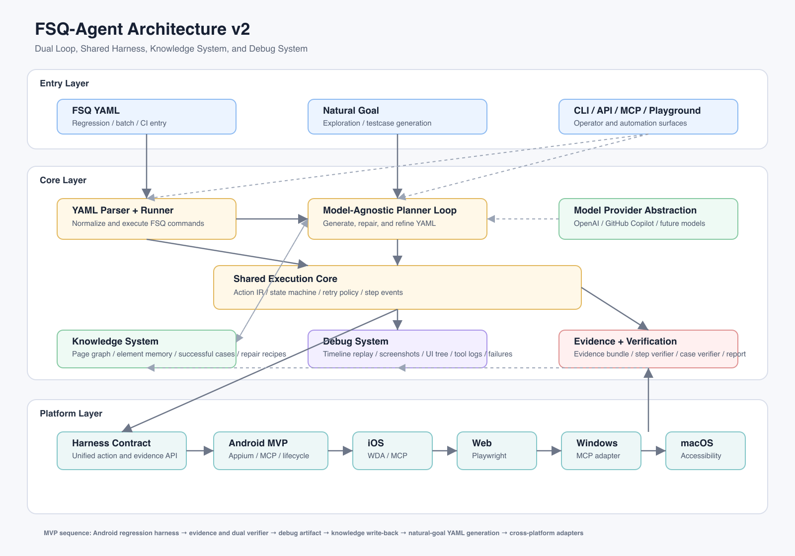
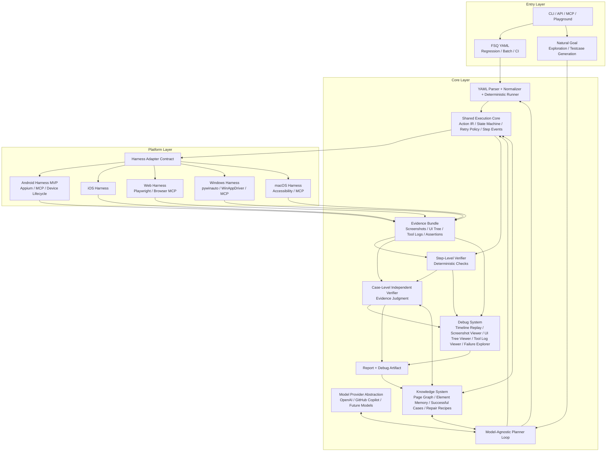
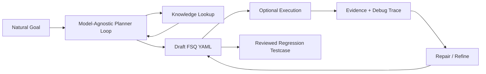

# FSQ-Agent Architecture v2

This draft captures the selected architecture direction for FSQ-Agent after comparing Midscene's layered design with FSQ's testing goals.

## Core Direction

FSQ-Agent should use a **Dual Loop, Shared Harness** architecture:

- **Regression loop**: FSQ YAML executes as trustworthy regression tests and can run without an agent.
- **Exploration loop**: Natural goals go through a model-agnostic planner to generate, execute, repair, and refine FSQ YAML.
- **Shared execution core**: Both loops use the same action contract, harness layer, evidence model, verifier, report, debug system, and knowledge system.

## Architecture Diagram

The PNG above is generated from [assets/fsq-agent-architecture-v2.svg](assets/fsq-agent-architecture-v2.svg). The Mermaid source below remains editable for future architecture changes.

## Loop 1: Regression Test Execution

```mermaid
flowchart LR
    A[FSQ YAML] --> B[Schema Validation]
    B --> C[Normalized Command Model]
    C --> D[Deterministic Runner]
    D --> E[Shared Execution Core]
    E --> F[Android Harness MVP]
    F --> G[Evidence Bundle]
    G --> H[Step-Level Verifier]
    H --> I[Case-Level Independent Verifier]
    I --> J[Report + Debug Artifact]
    J --> K[Knowledge System]
```

## Loop 2: Exploration and Testcase Generation

## Key Additions

### Knowledge System

The knowledge system is a first-class architecture block, not just prompt context. It stores and retrieves reusable testing knowledge:

- page graph and page transition knowledge
- element memory and stable locator candidates
- successful cases and known working action sequences
- failure patterns and repair recipes
- platform-specific execution notes

It supports both the regression runner and the natural-goal planner.

### Debug System

The debug system is a first-class architecture block, not just a report page. It should provide a Midscene-like debugging experience:

- step timeline replay
- screenshot and UI tree inspection
- real tool-call log inspection
- assertion evidence inspection
- verifier decision trace
- failure classification and repair hints

The debug artifact should be generated from the same evidence bundle used by the verifier so debugging and final judgment stay consistent.

## MVP Scope

The first implementation phase should focus on **Android regression execution**:

1. FSQ YAML validation and normalization.
2. Deterministic YAML runner that can execute without an agent.
3. Android harness adapter with device/app lifecycle control.
4. Evidence bundle with screenshot, UI tree, tool logs, and assertion records.
5. Step-level deterministic verifier.
6. Case-level independent verifier.
7. Report plus debug artifact.
8. Knowledge write-back for successful cases, failures, and repair recipes.

Natural-goal planning should come after the trusted regression loop is usable.
