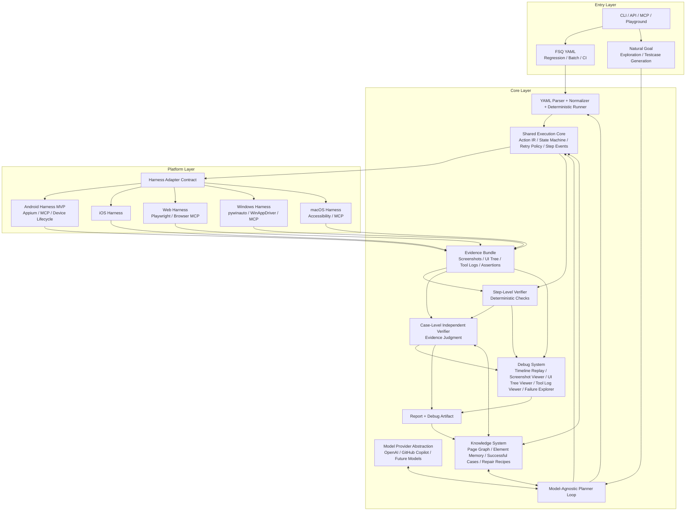
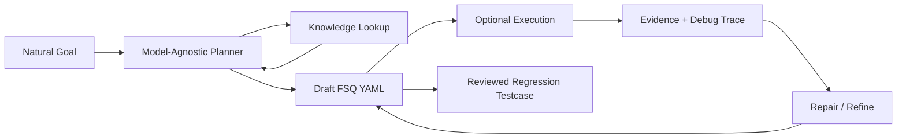

# FSQ-Agent v2 Architecture Design Spec

Status: draft for review
Date: 2026-06-04
Scope: architecture-level design, not an implementation commitment
Language policy: English is the contract source of truth. The Chinese section is a reading companion and should be updated in the same change whenever the English contract changes.

## 1. Purpose

FSQ-Agent v2 is the next-generation UI testing agent for FSQ. This spec defines the target architecture after studying Midscene's layered design and comparing it with FSQ's testing goals.

This document is an upstream architecture design. It does not directly change existing module contracts. Any implementation work must still update and confirm the relevant module-level `SPEC.md` files before code changes.

## 2. Goals

- Support two first-class test creation and execution modes:
  - FSQ YAML regression execution.
  - Natural-language goal exploration and testcase generation.
- Keep FSQ YAML executable without an agent so it can serve as a stable regression-test artifact.
- Provide a model-agnostic planner loop that can work with OpenAI, GitHub Copilot, and future model providers.
- Build a strong harness layer that makes execution trustworthy, repeatable, observable, and portable across platforms.
- Produce evidence that can support independent verification, report generation, debugging, and future knowledge reuse.
- Make Android the MVP platform while keeping the architecture open for Web, iOS, Windows, and macOS.

## 3. Non-Goals

- This spec does not define every FSQ YAML command in detail.
- This spec does not replace existing module-level specs.
- This spec does not require natural-goal planning to be implemented before the regression runner is usable.
- This spec does not require all platforms to be implemented in the MVP.
- This spec does not make knowledge data an authority over live UI evidence. Knowledge is advisory unless a later module spec explicitly promotes a subset into deterministic configuration.

## 4. Midscene Lessons

Midscene is useful because its architecture separates entry integrations, core orchestration, and platform execution. Browser integration is not the whole product; the core planning and task execution logic lives in `packages/core`.

The main lessons for FSQ-Agent are:

- Keep entry points thin. CLI, MCP, API, playground, and framework integrations should call stable core APIs.
- Centralize planning and execution policy in the core layer.
- Treat platform integrations as adapters that expose capabilities and observations through a common contract.
- Persist execution traces and screenshots as first-class debugging assets.
- Keep YAML execution separate enough that it can be used as a deterministic test runner.

FSQ-Agent differs from Midscene in one important way: FSQ needs stronger regression-test trust. The architecture therefore puts more emphasis on deterministic YAML execution, evidence bundles, independent verification, and harness reliability.

## 5. Architecture Decision

FSQ-Agent v2 should use a **Dual Loop, Shared Harness** architecture.

The two loops are:

- **Regression loop**: FSQ YAML is parsed, normalized, and executed as a regression test. This path can run without an agent.
- **Exploration loop**: A natural-language goal goes through a model-agnostic planner. The planner uses knowledge and live evidence to generate, execute, repair, and refine FSQ YAML.

Both loops share:

- action contract
- execution state machine
- harness adapter contract
- evidence bundle
- verifier interfaces
- report pipeline
- debug system
- knowledge system

## 6. Target Architecture

The editable visual draft is maintained in `docs/fsq-agent-architecture-v2.md` and its PNG asset is embedded there. The architecture-level structure is:

## 7. Entry Layer

The entry layer should expose workflows without owning core behavior.

Required entry types:

- CLI regression execution for one case, batch cases, and CI.
- CLI or API natural-goal execution for exploration and testcase generation.
- MCP entry for external agent/tool ecosystems.
- Playground or debug UI entry for local investigation.

Entry points should pass normalized request objects into the core layer and should not contain platform-specific action logic.

## 8. Regression Loop

The regression loop is the first execution priority.

```mermaid
flowchart LR
    A[FSQ YAML] --> B[Schema Validation]
    B --> C[Normalized Command Model]
    C --> D[Deterministic Runner]
    D --> E[Shared Execution Core]
    E --> F[Harness Adapter]
    F --> G[Evidence Bundle]
    G --> H[Step-Level Verifier]
    H --> I[Case-Level Independent Verifier]
    I --> J[Report + Debug Artifact]
    J --> K[Knowledge Write-Back]
```

Regression execution requirements:

- FSQ YAML must be validatable before execution.
- YAML commands must normalize into a stable internal action representation.
- The deterministic runner must not require a planner model.
- Each step should emit structured events and evidence references.
- Step-level deterministic verification should run as close to execution as possible.
- Case-level verification should judge the final result from the evidence bundle, not from runner optimism.
- Reports and debug artifacts should be generated from the same evidence used by verification.

## 9. Exploration Loop

The exploration loop turns natural goals into durable FSQ YAML.

Exploration requirements:

- The planner should produce FSQ YAML or a structured testcase draft, not only perform ad hoc UI actions.
- The planner may execute draft steps through the shared execution core to validate and repair them.
- Successful generated cases should become candidate regression tests after review.
- Failures should feed the debug system and knowledge system.
- The planner must be model-provider neutral.

## 10. Core Subsystems

### Model Provider Abstraction

The model layer should hide provider-specific authentication, request shape, streaming behavior, and tool-calling differences from the planner. OpenAI and GitHub Copilot are the minimum target providers. Future providers should be added behind the same planning interface.

### Planner Loop

The planner loop owns goal decomposition, action planning, repair, and YAML generation. It should consume knowledge and evidence but should not bypass the shared execution core when it needs real UI actions.

### FSQ YAML Parser and Runner

The YAML subsystem owns schema validation, command normalization, and deterministic execution. It should become more than advisory prompt context. In v2, FSQ YAML is a regression artifact with direct execution semantics.

### Shared Execution Core

The execution core owns the action IR, step state machine, retry policy, timeout policy, event emission, and evidence attachment. Both regression and exploration paths use it.

### Harness Adapter Contract

The harness contract provides platform capabilities through a stable interface. A harness should expose actions, observations, lifecycle controls, and capability metadata. Platform-specific details stay inside adapters.

### Evidence Bundle

The evidence bundle is the authoritative record of execution. It should include screenshots, UI tree snapshots, tool logs, action records, assertion records, verifier decisions, timing, environment metadata, and artifact paths.

### Step-Level Verifier

The step verifier handles deterministic checks close to execution. Examples include command result status, element existence after action, text equality, app state, and tool-level assertion outputs.

### Case-Level Independent Verifier

The case verifier judges whether the whole test case passed from the evidence bundle. It should be independent from the execution loop. It may be model-assisted, but it must use supplied evidence rather than unsupported claims.

### Debug System

The debug system is a first-class product surface, not just static report text. It should support timeline replay, screenshot inspection, UI tree inspection, tool log inspection, assertion evidence inspection, verifier trace review, and failure exploration.

### Knowledge System

The knowledge system stores reusable testing experience. It should include page graph data, element memory, successful action sequences, failure patterns, repair recipes, platform notes, and model/planner lessons. It is used by both loops and updated by reports or reviewed runs.

### Report System

The report system produces human-readable and machine-readable artifacts. Reports should reference debug artifacts and evidence bundles instead of duplicating all raw data.

## 11. Harness Priorities

Harness design should optimize in this order:

1. Result trustworthiness.
2. Platform uniformity.
3. Execution stability.

The harness must make it clear which capabilities are available, what evidence each action produced, and whether failures are action failures, observation failures, lifecycle failures, or verification failures.

## 12. Android MVP

The MVP should focus on Android regression execution.

MVP scope:

- FSQ YAML validation and normalization.
- Deterministic FSQ YAML runner.
- Shared execution core for normalized actions.
- Android harness adapter using Appium, MCP, or a hybrid based on the current tool stack.
- Device and app lifecycle control.
- Evidence bundle with screenshot, UI tree, tool log, and assertion records.
- Step-level deterministic verification.
- Case-level independent verification.
- Report and debug artifact generation.
- Knowledge write-back for successful cases, failures, and repair recipes.

Natural-goal planning should follow after the regression loop is usable enough to trust as a target for generated tests.

## 13. Existing Module Mapping

The current repository already has useful building blocks, but several v2 concepts are broader than the existing modules.

| v2 Concept | Current Module Starting Point | Expected Direction |
| --- | --- | --- |
| CLI entry | `cli` | Add explicit regression and exploration workflows. |
| Natural-goal planner | `agent` | Generalize toward model-provider-neutral planner loop. |
| Model provider | `agent`, `config` | Extract provider abstraction from OpenAI-specific runtime assumptions. |
| FSQ YAML runner | `fsq` | Evolve from advisory task adapter to deterministic parser/runner path. |
| Shared execution core | `agent`, `tools`, future module | Define action IR, step state, retry, timeout, and event contract. |
| Harness adapter | `tools`, lifecycle controllers | Promote platform operations into a stable harness contract. |
| Evidence bundle | `report`, `observation`, `tools` | Make evidence an explicit cross-module data model. |
| Step verifier | `agent`, future module | Separate deterministic step checks from final case judgment. |
| Case verifier | `agent` | Keep independent evidence-based verification, make contract explicit. |
| Debug system | `report`, future module | Add Midscene-like HTML/debug UI artifacts. |
| Knowledge system | `knowledge` | Expand from read-only context to curated knowledge plus reviewed write-back. |
| Report system | `report` | Keep Markdown/JSON, add debug artifact references and evidence traceability. |

## 14. Roadmap

### Phase 0: Architecture and Contracts

- Finalize this architecture spec.
- Split required module-level changes into module `SPEC.md` updates.
- Define action IR, evidence bundle schema, harness adapter contract, and verifier contracts.

### Phase 1: Android Regression Runner

- Implement YAML validation and normalization.
- Implement deterministic runner over shared execution core.
- Implement Android harness MVP.
- Emit evidence bundle and structured events.
- Produce report and debug artifact.

### Phase 2: Trust and Debugging

- Harden step verifier and case verifier.
- Add timeline replay and evidence browser.
- Improve failure classification and repair hints.
- Add knowledge write-back review flow.

### Phase 3: Natural Goal to FSQ YAML

- Implement model-provider-neutral planner.
- Generate draft FSQ YAML from natural goals.
- Execute and repair generated drafts through the same runner.
- Promote reviewed generated cases into regression assets.

### Phase 4: Multi-Platform Expansion

- Add Web harness.
- Add iOS harness.
- Add Windows and macOS harnesses.
- Standardize platform capability discovery and portability checks.

## 15. Risks

- Deterministic YAML execution may require tightening the FSQ command schema beyond the current advisory model.
- Evidence volume can grow quickly; the system needs bounded artifact references and searchable debug data.
- Model-provider neutrality is difficult if provider tool-calling semantics diverge.
- Knowledge write-back can pollute future runs if unreviewed failures are stored as reliable facts.
- Harness uniformity can hide important platform differences if the contract is too abstract.
- Debug UI can become a second report format unless it is generated from the same evidence bundle.

## 16. Deferred Decisions

The architecture can be approved before these decisions are finalized. Each item should be resolved in the relevant module-level spec or implementation plan.

- Should knowledge write-back be automatic, review-gated, or split by confidence level?
- Should the debug system start as static HTML artifacts or a local web app?
- Should the Android MVP harness call Appium directly, through MCP, or through a hybrid adapter?
- Which FSQ YAML commands must be deterministic in the first regression-runner milestone?
- What is the minimum evidence bundle schema needed for CI trust?

## 17. Approval Criteria

This architecture spec is ready to drive implementation planning when these statements are accepted:

- FSQ-Agent v2 uses Dual Loop, Shared Harness as the target architecture.
- FSQ YAML is a regression-test artifact and must be executable without an agent.
- Natural goals are an exploration and testcase-generation entry, not the only execution mode.
- Android regression execution is the MVP.
- Evidence, verification, report, debug, and knowledge are first-class architecture concerns.
- Implementation must proceed through module-level SPEC updates before code changes.

---

# FSQ-Agent v2 架构设计 Spec 中文阅读版

状态：待评审草案
日期：2026-06-04
范围：架构级设计，不代表立即实现承诺
语言策略：英文部分是契约级事实来源。中文部分用于提升阅读效率；英文契约发生变化时，中文部分应在同一次变更中同步更新。

## 1. 目的

FSQ-Agent v2 是 FSQ 的下一代 UI Testing Agent。本 spec 在学习 Midscene 分层架构后，结合 FSQ 的测试目标，定义 FSQ-Agent 的目标架构。

本文档是上游架构设计，不直接修改现有模块接口。任何实现工作仍然必须先更新并确认相关模块级 `SPEC.md`，然后才能修改代码。

## 2. 目标

- 支持两种一等公民的测试创建和执行模式：
  - FSQ YAML 回归测试执行。
  - Natural-language goal 探索和测试用例生成。
- FSQ YAML 必须可以在没有 agent 的情况下执行，作为稳定的回归测试资产。
- 提供模型无关的 planner loop，至少支持 OpenAI、GitHub Copilot，并为未来模型保留扩展空间。
- 构建强 harness 层，让执行结果可信、可重复、可观察，并可迁移到多平台。
- 生成可支撑独立验证、报告、debug 和知识复用的 evidence。
- MVP 聚焦 Android，同时保留 Web、iOS、Windows、macOS 的架构扩展能力。

## 3. 非目标

- 本 spec 不详细定义每一个 FSQ YAML command。
- 本 spec 不替代现有模块级 spec。
- 本 spec 不要求先实现 natural-goal planning，才让 regression runner 可用。
- 本 spec 不要求 MVP 实现所有平台。
- 本 spec 不把知识库数据作为高于 live UI evidence 的权威来源。知识库默认是辅助信息，除非后续模块 spec 明确把某些知识提升为确定性配置。

## 4. Midscene 学习结论

Midscene 值得学习的关键点是：它把入口集成、核心编排、平台执行分开。浏览器集成不是产品全部，核心规划和任务执行逻辑主要在 `packages/core`。

对 FSQ-Agent 的主要启发：

- 入口层要薄。CLI、MCP、API、playground、框架集成都应该调用稳定的 core API。
- planner、执行策略、任务状态机应集中在 core layer。
- 平台集成应该是 adapter，通过统一 contract 暴露能力和观察结果。
- 执行 trace、截图、UI tree、tool log 应作为一等 debug 资产持久化。
- YAML 执行应足够独立，能成为确定性的 test runner。

FSQ-Agent 和 Midscene 的重要差异是：FSQ 更强调 regression test 的可信度。因此架构上要更重视确定性 YAML 执行、evidence bundle、独立 verifier 和 harness 可靠性。

## 5. 架构决策

FSQ-Agent v2 采用 **Dual Loop, Shared Harness** 架构。

两条 loop：

- **Regression loop**：FSQ YAML 被解析、规范化，并作为 regression test 执行。这条路径不依赖 agent。
- **Exploration loop**：Natural goal 进入模型无关 planner。Planner 使用知识库和 live evidence 来生成、执行、修复、迭代 FSQ YAML。

两条 loop 共享：

- action contract
- execution state machine
- harness adapter contract
- evidence bundle
- verifier interfaces
- report pipeline
- debug system
- knowledge system

## 6. 目标架构

可编辑的可视化草案保存在 `docs/fsq-agent-architecture-v2.md`，其中已经嵌入 PNG 架构图。架构结构分为三层：

- Entry Layer：FSQ YAML、Natural Goal、CLI/API/MCP/Playground。
- Core Layer：YAML runner、planner、shared execution core、model provider、knowledge、debug、evidence、verifier、report。
- Platform Layer：统一 harness contract，以及 Android、iOS、Web、Windows、macOS adapter。

## 7. 入口层

入口层负责暴露 workflow，但不拥有核心行为。

需要支持的入口类型：

- CLI regression execution，支持单 case、batch、CI。
- CLI 或 API natural-goal execution，支持探索和测试用例生成。
- MCP entry，支持外部 agent/tool 生态。
- Playground 或 debug UI entry，支持本地调查和调试。

入口层应该把规范化 request object 传给 core layer，不应该包含平台动作逻辑。

## 8. Regression Loop

Regression loop 是第一优先级。

执行要求：

- FSQ YAML 必须在执行前完成 schema validation。
- YAML commands 必须规范化为稳定的 internal action representation。
- Deterministic runner 不能依赖 planner model。
- 每一步都应该产生结构化 event 和 evidence reference。
- Step-level deterministic verification 应尽量靠近执行点发生。
- Case-level verification 应基于 evidence bundle 判断结果，而不是相信 runner 的乐观声明。
- Report 和 debug artifact 应从 verifier 使用的同一份 evidence 生成。

## 9. Exploration Loop

Exploration loop 把 natural goal 转换成可长期维护的 FSQ YAML。

执行要求：

- Planner 应输出 FSQ YAML 或结构化 testcase draft，而不只是临时执行 UI 动作。
- Planner 可以通过 shared execution core 执行 draft steps，用于验证和修复。
- 成功生成的 case 在 review 后可以成为 regression test。
- 失败信息应进入 debug system 和 knowledge system。
- Planner 必须保持 model-provider neutral。

## 10. 核心子系统

### Model Provider Abstraction

模型层隐藏 provider 特定的认证、请求格式、streaming 行为和 tool-calling 差异。最低目标 provider 是 OpenAI 和 GitHub Copilot，未来 provider 应通过同一 planner interface 接入。

### Planner Loop

Planner loop 负责 goal decomposition、action planning、repair 和 YAML generation。它可以消费知识和 evidence，但需要真实 UI 动作时必须通过 shared execution core。

### FSQ YAML Parser and Runner

YAML 子系统负责 schema validation、command normalization 和 deterministic execution。v2 中 FSQ YAML 不再只是 prompt context，而是具有直接执行语义的 regression artifact。

### Shared Execution Core

Execution core 负责 action IR、step state machine、retry policy、timeout policy、event emission 和 evidence attachment。Regression 和 exploration 都使用它。

### Harness Adapter Contract

Harness contract 通过稳定接口提供平台能力。Harness 应暴露 actions、observations、lifecycle controls 和 capability metadata。平台细节留在 adapter 内部。

### Evidence Bundle

Evidence bundle 是执行过程的权威记录，包含 screenshot、UI tree snapshot、tool log、action record、assertion record、verifier decision、timing、environment metadata 和 artifact path。

### Step-Level Verifier

Step verifier 处理靠近执行点的确定性检查，例如 command result status、action 后 element existence、text equality、app state、tool-level assertion output。

### Case-Level Independent Verifier

Case verifier 从 evidence bundle 判断整个 case 是否通过。它应独立于执行 loop。可以 model-assisted，但必须基于提供的 evidence，而不是无依据的 claim。

### Debug System

Debug system 是一等产品界面，不只是静态报告文本。它应支持 timeline replay、screenshot inspection、UI tree inspection、tool log inspection、assertion evidence inspection、verifier trace review 和 failure exploration。

### Knowledge System

Knowledge system 存储可复用测试经验，包括 page graph、element memory、successful action sequence、failure pattern、repair recipe、platform note、model/planner lesson。它被两条 loop 使用，并由 report 或 reviewed run 更新。

### Report System

Report system 生成面向人和机器的产物。Report 应引用 debug artifacts 和 evidence bundles，而不是复制所有原始数据。

## 11. Harness 优先级

Harness 设计优先级：

1. 结果可信度。
2. 平台统一性。
3. 执行稳定性。

Harness 必须清楚说明可用能力、每个 action 产生的 evidence，以及失败属于 action failure、observation failure、lifecycle failure 还是 verification failure。

## 12. Android MVP

MVP 聚焦 Android regression execution。

MVP 范围：

- FSQ YAML validation 和 normalization。
- Deterministic FSQ YAML runner。
- 面向 normalized actions 的 shared execution core。
- 基于当前 tool stack 的 Android harness adapter，可以是 Appium、MCP 或 hybrid。
- Device 和 app lifecycle control。
- 包含 screenshot、UI tree、tool log、assertion record 的 evidence bundle。
- Step-level deterministic verification。
- Case-level independent verification。
- Report 和 debug artifact generation。
- 对 successful cases、failures、repair recipes 进行 knowledge write-back。

Natural-goal planning 应在 regression loop 足够可信后再推进。

## 13. 现有模块映射

当前仓库已有一些可复用基础，但 v2 中若干概念比现有模块更大。

| v2 概念 | 当前模块起点 | 预期方向 |
| --- | --- | --- |
| CLI entry | `cli` | 增加明确的 regression 和 exploration workflow。 |
| Natural-goal planner | `agent` | 泛化为 model-provider-neutral planner loop。 |
| Model provider | `agent`, `config` | 从 OpenAI-specific runtime 中抽出 provider abstraction。 |
| FSQ YAML runner | `fsq` | 从 advisory task adapter 演进为 deterministic parser/runner path。 |
| Shared execution core | `agent`, `tools`, future module | 定义 action IR、step state、retry、timeout、event contract。 |
| Harness adapter | `tools`, lifecycle controllers | 把平台操作提升为稳定 harness contract。 |
| Evidence bundle | `report`, `observation`, `tools` | 把 evidence 做成显式跨模块 data model。 |
| Step verifier | `agent`, future module | 从最终 case judgment 中拆出 deterministic step checks。 |
| Case verifier | `agent` | 保留独立 evidence-based verification，并明确 contract。 |
| Debug system | `report`, future module | 增加类似 Midscene 的 HTML/debug UI artifact。 |
| Knowledge system | `knowledge` | 从 read-only context 扩展为 curated knowledge 和 reviewed write-back。 |
| Report system | `report` | 保留 Markdown/JSON，增加 debug artifact references 和 evidence traceability。 |

## 14. Roadmap

### Phase 0: Architecture and Contracts

- 完成本 architecture spec。
- 把需要的变化拆到模块级 `SPEC.md`。
- 定义 action IR、evidence bundle schema、harness adapter contract、verifier contracts。

### Phase 1: Android Regression Runner

- 实现 YAML validation 和 normalization。
- 基于 shared execution core 实现 deterministic runner。
- 实现 Android harness MVP。
- 产生 evidence bundle 和 structured events。
- 生成 report 和 debug artifact。

### Phase 2: Trust and Debugging

- 强化 step verifier 和 case verifier。
- 增加 timeline replay 和 evidence browser。
- 改进 failure classification 和 repair hints。
- 增加 knowledge write-back review flow。

### Phase 3: Natural Goal to FSQ YAML

- 实现 model-provider-neutral planner。
- 从 natural goal 生成 draft FSQ YAML。
- 通过同一 runner 执行并修复生成的 draft。
- 把 reviewed generated cases 提升为 regression assets。

### Phase 4: Multi-Platform Expansion

- 增加 Web harness。
- 增加 iOS harness。
- 增加 Windows 和 macOS harness。
- 标准化平台 capability discovery 和 portability checks。

## 15. 风险

- Deterministic YAML execution 可能要求收紧当前 advisory model 下的 FSQ command schema。
- Evidence 体积会快速增长，需要 bounded artifact references 和 searchable debug data。
- 如果 provider tool-calling 语义差异很大，model-provider neutrality 会比较困难。
- 未经 review 的 failure 如果写入知识库，可能污染未来运行。
- Harness contract 过度抽象可能掩盖重要平台差异。
- Debug UI 如果不从同一 evidence bundle 生成，可能变成第二套 report format。

## 16. 延后决策项

这些决策不阻塞当前 architecture approval。每一项应在相关模块级 spec 或 implementation plan 中解决。

- Knowledge write-back 应自动、review-gated，还是按 confidence level 分层？
- Debug system 应先做 static HTML artifacts，还是 local web app？
- Android MVP harness 应直接调用 Appium、通过 MCP，还是 hybrid adapter？
- 第一阶段 regression-runner 里哪些 FSQ YAML commands 必须 deterministic？
- CI trust 所需的最小 evidence bundle schema 是什么？

## 17. 通过标准

当以下判断被接受时，本 architecture spec 可以驱动 implementation planning：

- FSQ-Agent v2 采用 Dual Loop, Shared Harness 作为目标架构。
- FSQ YAML 是 regression-test artifact，必须可以无 agent 执行。
- Natural goals 是 exploration 和 testcase-generation 入口，不是唯一执行模式。
- Android regression execution 是 MVP。
- Evidence、verification、report、debug、knowledge 都是一等架构关注点。
- 实现必须先经过模块级 SPEC 更新，再进入代码修改。
