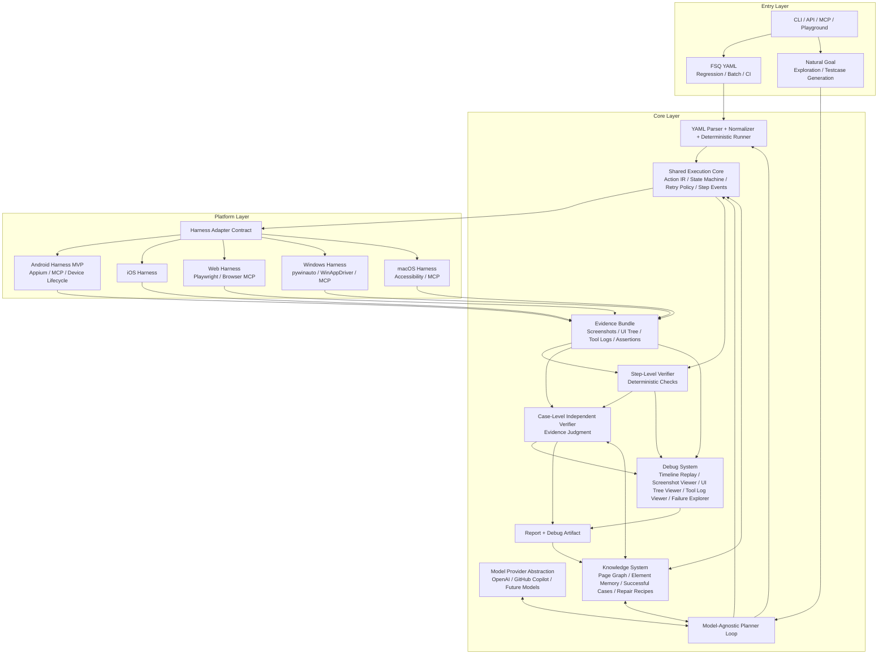
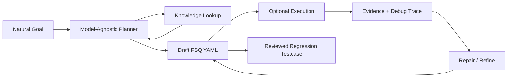

# FSQ-Agent v2 Architecture Design Spec

Status: draft for review
Date: 2026-06-04
Scope: architecture-level design, not an implementation commitment

## 1. Purpose

FSQ-Agent v2 is the next-generation UI testing agent for FSQ. This spec defines the target architecture after studying Midscene's layered design and comparing it with FSQ's testing goals.

This document is an upstream architecture design. It does not directly change existing module contracts. Any implementation work must still update and confirm the relevant module-level `SPEC.md` files before code changes.

## 2. Goals

- Support two first-class test creation and execution modes:
  - FSQ YAML regression execution.
  - Natural-language goal exploration and testcase generation.
- Keep FSQ YAML executable without an agent so it can serve as a stable regression-test artifact.
- Provide a model-agnostic planner loop that can work with OpenAI, GitHub Copilot, and future model providers.
- Build a strong harness layer that makes execution trustworthy, repeatable, observable, and portable across platforms.
- Produce evidence that can support independent verification, report generation, debugging, and future knowledge reuse.
- Make Android the MVP platform while keeping the architecture open for Web, iOS, Windows, and macOS.

## 3. Non-Goals

- This spec does not define every FSQ YAML command in detail.
- This spec does not replace existing module-level specs.
- This spec does not require natural-goal planning to be implemented before the regression runner is usable.
- This spec does not require all platforms to be implemented in the MVP.
- This spec does not make knowledge data an authority over live UI evidence. Knowledge is advisory unless a later module spec explicitly promotes a subset into deterministic configuration.

## 4. Midscene Lessons

Midscene is useful because its architecture separates entry integrations, core orchestration, and platform execution. Browser integration is not the whole product; the core planning and task execution logic lives in `packages/core`.

The main lessons for FSQ-Agent are:

- Keep entry points thin. CLI, MCP, API, playground, and framework integrations should call stable core APIs.
- Centralize planning and execution policy in the core layer.
- Treat platform integrations as adapters that expose capabilities and observations through a common contract.
- Persist execution traces and screenshots as first-class debugging assets.
- Keep YAML execution separate enough that it can be used as a deterministic test runner.

FSQ-Agent differs from Midscene in one important way: FSQ needs stronger regression-test trust. The architecture therefore puts more emphasis on deterministic YAML execution, evidence bundles, independent verification, and harness reliability.

## 5. Architecture Decision

FSQ-Agent v2 should use a **Dual Loop, Shared Harness** architecture.

The two loops are:

- **Regression loop**: FSQ YAML is parsed, normalized, and executed as a regression test. This path can run without an agent.
- **Exploration loop**: A natural-language goal goes through a model-agnostic planner. The planner uses knowledge and live evidence to generate, execute, repair, and refine FSQ YAML.

Both loops share:

- action contract
- execution state machine
- harness adapter contract
- evidence bundle
- verifier interfaces
- report pipeline
- debug system
- knowledge system

## 6. Target Architecture

The editable visual draft is maintained in `docs/fsq-agent-architecture-v2.md` and its PNG asset is embedded there. The architecture-level structure is:

## 7. Entry Layer

The entry layer should expose workflows without owning core behavior.

Required entry types:

- CLI regression execution for one case, batch cases, and CI.
- CLI or API natural-goal execution for exploration and testcase generation.
- MCP entry for external agent/tool ecosystems.
- Playground or debug UI entry for local investigation.

Entry points should pass normalized request objects into the core layer and should not contain platform-specific action logic.

## 8. Regression Loop

The regression loop is the first execution priority.

```mermaid
flowchart LR
    A[FSQ YAML] --> B[Schema Validation]
    B --> C[Normalized Command Model]
    C --> D[Deterministic Runner]
    D --> E[Shared Execution Core]
    E --> F[Harness Adapter]
    F --> G[Evidence Bundle]
    G --> H[Step-Level Verifier]
    H --> I[Case-Level Independent Verifier]
    I --> J[Report + Debug Artifact]
    J --> K[Knowledge Write-Back]
```

Regression execution requirements:

- FSQ YAML must be validatable before execution.
- YAML commands must normalize into a stable internal action representation.
- The deterministic runner must not require a planner model.
- Each step should emit structured events and evidence references.
- Step-level deterministic verification should run as close to execution as possible.
- Case-level verification should judge the final result from the evidence bundle, not from runner optimism.
- Reports and debug artifacts should be generated from the same evidence used by verification.

## 9. Exploration Loop

The exploration loop turns natural goals into durable FSQ YAML.

Exploration requirements:

- The planner should produce FSQ YAML or a structured testcase draft, not only perform ad hoc UI actions.
- The planner may execute draft steps through the shared execution core to validate and repair them.
- Successful generated cases should become candidate regression tests after review.
- Failures should feed the debug system and knowledge system.
- The planner must be model-provider neutral.

## 10. Core Subsystems

### Model Provider Abstraction

The model layer should hide provider-specific authentication, request shape, streaming behavior, and tool-calling differences from the planner. OpenAI and GitHub Copilot are the minimum target providers. Future providers should be added behind the same planning interface.

### Planner Loop

The planner loop owns goal decomposition, action planning, repair, and YAML generation. It should consume knowledge and evidence but should not bypass the shared execution core when it needs real UI actions.

### FSQ YAML Parser and Runner

The YAML subsystem owns schema validation, command normalization, and deterministic execution. It should become more than advisory prompt context. In v2, FSQ YAML is a regression artifact with direct execution semantics.

### Shared Execution Core

The execution core owns the action IR, step state machine, retry policy, timeout policy, event emission, and evidence attachment. Both regression and exploration paths use it.

### Harness Adapter Contract

The harness contract provides platform capabilities through a stable interface. A harness should expose actions, observations, lifecycle controls, and capability metadata. Platform-specific details stay inside adapters.

### Evidence Bundle

The evidence bundle is the authoritative record of execution. It should include screenshots, UI tree snapshots, tool logs, action records, assertion records, verifier decisions, timing, environment metadata, and artifact paths.

### Step-Level Verifier

The step verifier handles deterministic checks close to execution. Examples include command result status, element existence after action, text equality, app state, and tool-level assertion outputs.

### Case-Level Independent Verifier

The case verifier judges whether the whole test case passed from the evidence bundle. It should be independent from the execution loop. It may be model-assisted, but it must use supplied evidence rather than unsupported claims.

### Debug System

The debug system is a first-class product surface, not just static report text. It should support timeline replay, screenshot inspection, UI tree inspection, tool log inspection, assertion evidence inspection, verifier trace review, and failure exploration.

### Knowledge System

The knowledge system stores reusable testing experience. It should include page graph data, element memory, successful action sequences, failure patterns, repair recipes, platform notes, and model/planner lessons. It is used by both loops and updated by reports or reviewed runs.

### Report System

The report system produces human-readable and machine-readable artifacts. Reports should reference debug artifacts and evidence bundles instead of duplicating all raw data.

## 11. Harness Priorities

Harness design should optimize in this order:

1. Result trustworthiness.
2. Platform uniformity.
3. Execution stability.

The harness must make it clear which capabilities are available, what evidence each action produced, and whether failures are action failures, observation failures, lifecycle failures, or verification failures.

## 12. Android MVP

The MVP should focus on Android regression execution.

MVP scope:

- FSQ YAML validation and normalization.
- Deterministic FSQ YAML runner.
- Shared execution core for normalized actions.
- Android harness adapter using Appium, MCP, or a hybrid based on the current tool stack.
- Device and app lifecycle control.
- Evidence bundle with screenshot, UI tree, tool log, and assertion records.
- Step-level deterministic verification.
- Case-level independent verification.
- Report and debug artifact generation.
- Knowledge write-back for successful cases, failures, and repair recipes.

Natural-goal planning should follow after the regression loop is usable enough to trust as a target for generated tests.

## 13. Existing Module Mapping

The current repository already has useful building blocks, but several v2 concepts are broader than the existing modules.

| v2 Concept | Current Module Starting Point | Expected Direction |
| --- | --- | --- |
| CLI entry | `cli` | Add explicit regression and exploration workflows. |
| Natural-goal planner | `agent` | Generalize toward model-provider-neutral planner loop. |
| Model provider | `agent`, `config` | Extract provider abstraction from OpenAI-specific runtime assumptions. |
| FSQ YAML runner | `fsq` | Evolve from advisory task adapter to deterministic parser/runner path. |
| Shared execution core | `agent`, `tools`, future module | Define action IR, step state, retry, timeout, and event contract. |
| Harness adapter | `tools`, lifecycle controllers | Promote platform operations into a stable harness contract. |
| Evidence bundle | `report`, `observation`, `tools` | Make evidence an explicit cross-module data model. |
| Step verifier | `agent`, future module | Separate deterministic step checks from final case judgment. |
| Case verifier | `agent` | Keep independent evidence-based verification, make contract explicit. |
| Debug system | `report`, future module | Add Midscene-like HTML/debug UI artifacts. |
| Knowledge system | `knowledge` | Expand from read-only context to curated knowledge plus reviewed write-back. |
| Report system | `report` | Keep Markdown/JSON, add debug artifact references and evidence traceability. |

## 14. Roadmap

### Phase 0: Architecture and Contracts

- Finalize this architecture spec.
- Split required module-level changes into module `SPEC.md` updates.
- Define action IR, evidence bundle schema, harness adapter contract, and verifier contracts.

### Phase 1: Android Regression Runner

- Implement YAML validation and normalization.
- Implement deterministic runner over shared execution core.
- Implement Android harness MVP.
- Emit evidence bundle and structured events.
- Produce report and debug artifact.

### Phase 2: Trust and Debugging

- Harden step verifier and case verifier.
- Add timeline replay and evidence browser.
- Improve failure classification and repair hints.
- Add knowledge write-back review flow.

### Phase 3: Natural Goal to FSQ YAML

- Implement model-provider-neutral planner.
- Generate draft FSQ YAML from natural goals.
- Execute and repair generated drafts through the same runner.
- Promote reviewed generated cases into regression assets.

### Phase 4: Multi-Platform Expansion

- Add Web harness.
- Add iOS harness.
- Add Windows and macOS harnesses.
- Standardize platform capability discovery and portability checks.

## 15. Risks

- Deterministic YAML execution may require tightening the FSQ command schema beyond the current advisory model.
- Evidence volume can grow quickly; the system needs bounded artifact references and searchable debug data.
- Model-provider neutrality is difficult if provider tool-calling semantics diverge.
- Knowledge write-back can pollute future runs if unreviewed failures are stored as reliable facts.
- Harness uniformity can hide important platform differences if the contract is too abstract.
- Debug UI can become a second report format unless it is generated from the same evidence bundle.

## 16. Deferred Decisions

The architecture can be approved before these decisions are finalized. Each item should be resolved in the relevant module-level spec or implementation plan.

- Should knowledge write-back be automatic, review-gated, or split by confidence level?
- Should the debug system start as static HTML artifacts or a local web app?
- Should the Android MVP harness call Appium directly, through MCP, or through a hybrid adapter?
- Which FSQ YAML commands must be deterministic in the first regression-runner milestone?
- What is the minimum evidence bundle schema needed for CI trust?

## 17. Approval Criteria

This architecture spec is ready to drive implementation planning when these statements are accepted:

- FSQ-Agent v2 uses Dual Loop, Shared Harness as the target architecture.
- FSQ YAML is a regression-test artifact and must be executable without an agent.
- Natural goals are an exploration and testcase-generation entry, not the only execution mode.
- Android regression execution is the MVP.
- Evidence, verification, report, debug, and knowledge are first-class architecture concerns.
- Implementation must proceed through module-level SPEC updates before code changes.
