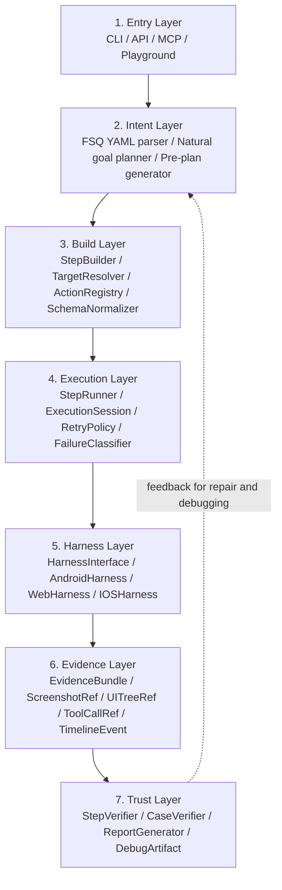

# FSQ-Agent v2 Shared Execution Core Design Spec

Status: draft for review
Date: 2026-06-08
Scope: architecture design for the shared execution core
Language policy: English is the contract source of truth. Chinese explanations are included where they help team discussion and should be kept aligned with the English design.

## 1. Purpose

This document defines the shared execution-core design for FSQ-Agent v2. It expands the key architecture idea behind the Midscene-inspired flow:

```text
Planner output / FSQ step
  -> StepBuilder / TaskBuilder
  -> ExecutableStep / ExecutionTask
  -> StepRunner / TaskRunner
  -> Harness Interface
  -> Evidence Bundle
```

The goal is to make FSQ-Agent's regression path and exploration path share the same execution core. YAML execution and natural-goal exploration should differ at the entry and planning layers, but converge before platform execution.

中文摘要：模型可以生成计划，FSQ YAML 可以描述流程，但真正执行时必须进入同一个 StepBuilder、StepRunner、Harness、Evidence 管线。这样 regression test 和 agent exploration 才能共享可靠性、证据和调试能力。

## 2. Core Principle

FSQ-Agent v2 should separate these responsibilities:

- **Planner / YAML parser** decides what the user intends to do.
- **StepBuilder** compiles semantic steps into executable steps.
- **StepRunner** executes steps through a state machine.
- **HarnessInterface** performs platform-specific operations.
- **EvidenceBundle** records execution facts.
- **Verifier** judges results from evidence, not from agent self-reporting.

The most important rule is:

```text
Models may generate plans, but they do not own execution facts.
YAML may describe flows, but it must not bypass the execution core.
Harnesses may operate platforms, but they do not decide case success.
Evidence is the source of truth, and verifiers judge from evidence.
```

## 3. Recommended FSQ Layering



## 4. Why This Design Matters

Without a shared execution core, FSQ-Agent risks creating two separate systems:

```text
YAML runner executes one way.
Agent planner executes another way.
MCP, reports, and debugging each reconstruct evidence differently.
```

That split creates practical problems:

- The same `tap` can behave differently in regression and exploration modes.
- Failures are difficult to classify consistently.
- Reports cannot reliably replay what happened.
- Verifiers receive incomplete or inconsistent evidence.
- New platforms require repeated integration work across multiple execution paths.

The shared-core design prevents that by making YAML and natural-goal execution converge before platform operations:

```text
FSQ YAML path       -> FSQStep[] -> StepBuilder -> StepRunner -> Harness -> Evidence
Natural goal path   -> FSQStep[] -> StepBuilder -> StepRunner -> Harness -> Evidence
```

中文解释：入口可以不同，但真正执行必须相同。这样生成出来的 testcase 和手写 regression testcase 才能有一致的行为、证据和可信度。

## 5. Main Concepts

### 5.1 FSQStep

`FSQStep` is the semantic test step. It is suitable for YAML, planner output, review, and long-term testcase storage.

Example:

```yaml
- action: tap
  target: 登录按钮
```

An `FSQStep` should be human-readable and durable. It should not contain platform transport details unless the command explicitly requires them.

### 5.2 ExecutableStep

`ExecutableStep` is the internal runtime step. It is produced by `StepBuilder` and consumed by `StepRunner`.

Example expansion:

```text
FSQStep: tap target="登录按钮"

ExecutableStep[]:
  1. observe_ui(before)
  2. resolve_target(prompt="登录按钮")
  3. invoke_action(type="tap", target_ref="$last_target")
  4. capture_evidence(after)
```

`ExecutableStep` should be stable, typed, and testable. It is the boundary where semantic intent becomes executable behavior.

### 5.3 StepBuilder

`StepBuilder` compiles semantic steps into executable steps. It should not operate devices directly.

Responsibilities:

- Normalize planner output and YAML steps into a common internal form.
- Validate command names, required fields, and parameter types.
- Resolve each action through `ActionRegistry`.
- Inject target-resolution steps where needed.
- Attach evidence policy, retry policy, timeout policy, and failure policy.
- Preserve source references so reports can trace runtime steps back to YAML or planner output.

Midscene analogy: `TaskBuilder` turns model `PlanningAction[]` into `Planning / Locate` and `Action Space / Tap` tasks.

FSQ-Agent equivalent:

```text
tap "登录按钮"
  -> ResolveTarget("登录按钮")
  -> InvokeHarnessAction("tap")
  -> CaptureEvidence("after_action")
```

### 5.4 StepRunner

`StepRunner` executes `ExecutableStep[]`. It should not understand user intent; it should only manage reliable execution.

Responsibilities:

- Maintain step status: `pending`, `running`, `success`, `failed`, `skipped`, `cancelled`.
- Build an `ExecutionContext` before each step.
- Call step executors in order.
- Call the harness through `HarnessInterface`.
- Capture timing, output, error, and evidence references.
- Stop or continue according to retry and failure policy.
- Emit timeline events for reports and debugging.

This is where engineering reliability lives. Planning quality can vary, but execution behavior must remain consistent and observable.

### 5.5 HarnessInterface

`HarnessInterface` is the platform contract. It plays the same architectural role as Midscene's `AbstractInterface`, but FSQ-Agent should make failure semantics and evidence references more explicit.

Core capabilities:

```text
get_context()
action_space()
invoke_action(action_name, params)
capture_evidence(reason)
before_action(action_name, params)
after_action(action_name, params)
device_state()
```

The harness owns platform-specific operations. Android, Web, iOS, desktop, and future platforms should implement the same contract.

### 5.6 EvidenceBundle

`EvidenceBundle` is the authoritative record of a run. It should hold references to artifacts rather than embedding large binary data in result models.

Minimum evidence for a step:

```text
step_id
source_ref
action
input
start_time / end_time
status
harness_call_ref
screenshot_before_ref
screenshot_after_ref
ui_tree_ref
tool_call_ref
error_ref
timeline_events
```

Verifiers and reports should read from `EvidenceBundle`, not from free-form agent claims.

## 6. Typical Execution Flow

Natural-language example:

```text
User: "点击登录按钮"
  -> Planning / Plan
  -> Model output: [{ type: "Tap", param: { locate: { prompt: "登录按钮" } } }]
  -> StepBuilder:
       generate ResolveTarget
       generate InvokeAction(Tap)
  -> StepRunner:
       get ExecutionContext
       run ResolveTarget, get element
       get or reuse ExecutionContext
       run Tap
       record screenshot, timing, output, errors
  -> Harness:
       tap(x, y)
  -> Platform:
       Playwright page.mouse.click(x, y) / Android tap / iOS tap
  -> EvidenceBundle:
       record all observable facts
  -> Verifier:
       judge from evidence
```

YAML regression example:

```text
fsq-agent run case.yaml
  -> FSQ YAML parser
  -> FSQStep[]
  -> StepBuilder
  -> ExecutableStep[]
  -> StepRunner
  -> HarnessInterface
  -> EvidenceBundle
  -> CaseVerifier
  -> ReportGenerator
```

Natural-goal exploration example:

```text
fsq-agent run-goal "打开下载页面并返回首页"
  -> Natural goal planner
  -> generated FSQStep[]
  -> StepBuilder
  -> StepRunner
  -> HarnessInterface
  -> EvidenceBundle
  -> planner repair if needed
  -> durable FSQ YAML candidate
  -> CaseVerifier
  -> ReportGenerator
```

## 7. Failure and Retry Model

FSQ-Agent should classify failures before reporting or replanning. A raw exception is not enough for a testing system.

Recommended first failure categories:

```text
device_not_connected
app_not_running
element_not_found
action_timeout
assertion_failed
permission_blocked
transport_error
schema_error
planner_error
unknown
```

Retry policy should be attached by `StepBuilder` and enforced by `StepRunner`.

Examples:

- `element_not_found`: refresh context, re-run target resolution, optionally ask planner to repair.
- `action_timeout`: capture evidence, retry once if the action is idempotent.
- `permission_blocked`: fail fast with a clear evidence-linked report.
- `schema_error`: fail before harness invocation because the step is invalid.

The planner may receive structured failure feedback, but the runner must own the factual failure record.

## 8. MVP Scope

The first implementation should make the regression path reliable before expanding the agent loop.

MVP should include:

- Internal `ExecutableStep` model.
- `ExecutionContext` model.
- `StepRunner` state machine.
- Minimal `StepBuilder` for `tap`, `input`, `back`, and `assertWithAI`.
- `HarnessInterface` plus `FakeHarness` for tests.
- Evidence references and timeline events.
- Report integration from `EvidenceBundle`.

MVP should defer:

- Full multi-platform support.
- Complex planner repair.
- Advanced element cache.
- Playground replay UI.
- Public MCP server exposure for the new core.

## 9. Implementation Plan

### Phase 1: Define Internal Execution Models

Goal: establish the core runtime vocabulary without platform integration.

Deliverables:

- `ExecutableStep`
- `ExecutionContext`
- `ExecutionStepResult`
- `EvidenceRef`
- `FailureCategory`

Acceptance:

- Unit tests can construct a fake executable step.
- A fake result can reference screenshot, UI tree, tool call, and timeline evidence.

### Phase 2: Implement Minimal StepRunner

Goal: build the state machine and timeline.

Deliverables:

- Sequential execution.
- Status transitions.
- Timing capture.
- Error capture.
- Cancellation of remaining steps after failure.

Acceptance:

- A three-step run succeeds with complete timing.
- If step two fails, step three is marked `cancelled`.
- Runner output can be serialized for report generation.

### Phase 3: Add HarnessInterface and FakeHarness

Goal: make platform access explicit and testable.

Deliverables:

- `HarnessInterface` protocol.
- `FakeHarness` test implementation.
- Fake screenshot, UI tree, and tool call evidence.

Acceptance:

- StepRunner can execute `tap`, `input`, and `back` through FakeHarness.
- Each harness call creates evidence references.

### Phase 4: Implement StepBuilder

Goal: compile semantic FSQ steps into executable steps.

Deliverables:

- Action lookup through `ActionRegistry`.
- Parameter normalization through `SchemaNormalizer`.
- Target-resolution step injection.
- Evidence policy injection.

Acceptance:

- `tap target="登录按钮"` expands into target resolution plus action invocation.
- Invalid action names fail during build, not during platform execution.

### Phase 5: Connect FSQ YAML Regression Path

Goal: make hand-written FSQ YAML use the shared execution core.

Deliverables:

- YAML-to-`FSQStep[]` adapter.
- `FSQStep[]` to `ExecutableStep[]` build path.
- Report integration from runner output and evidence bundle.

Acceptance:

- Existing regression cases can produce a shared-core timeline.
- Report output identifies each source YAML step and generated executable step.

### Phase 6: Connect Natural Goal Exploration Path

Goal: make planner output use the same execution path as YAML.

Deliverables:

- Planner output to `FSQStep[]` adapter.
- Structured failure feedback from runner to planner.
- Durable YAML candidate generation from successful plans.

Acceptance:

- `run-goal` no longer relies on scattered tool calls for execution.
- Planner repair receives structured failure categories and evidence refs.
- Successful exploration can emit reviewable FSQ YAML.

### Phase 7: Strengthen Trust Layer

Goal: make evidence the input to verification and reporting.

Deliverables:

- Step verifier input builder.
- Case verifier input builder.
- Evidence-only report sections.
- Debug artifact references.

Acceptance:

- Case success is not based on agent self-reporting.
- Verifier can identify which evidence supports each requirement.
- CI failure reports point to step IDs and evidence refs.

## 10. Design Guardrails

- Keep entry points thin. CLI, API, MCP, and Playground should call the same core APIs.
- Keep planner output separate from execution facts.
- Keep harnesses platform-specific but contract-compatible.
- Keep evidence references lightweight and durable.
- Do not let regression execution depend on natural-goal planning.
- Do not let reports infer facts that are missing from evidence.
- Prefer deterministic paths before AI calls: direct selector, cached target, UI tree match, then AI locate.

## 11. Open Questions

- Should `EvidenceBundle` be a single manifest file with artifact references, or a directory-level bundle with multiple typed manifests?
- Which Android harness path should be MVP: Appium direct, Appium MCP, or hybrid?
- Should `assertWithAI` be represented as an executable step, a verifier step, or both?
- How much of the current OpenAI Agents SDK runtime should remain during the first shared-core migration?
- Should planner repair happen inside `StepRunner` failure handling or outside through a higher-level orchestration loop?

## 12. Summary

The shared execution core is the center of FSQ-Agent v2. It lets FSQ keep natural-language exploration while becoming a trustworthy regression test system.

The target shape is:

```text
Planner / YAML
  -> StepBuilder
  -> ExecutableStep
  -> StepRunner
  -> HarnessInterface
  -> EvidenceBundle
  -> Verifier / Report / Debug
```

This is the architecture boundary that should remain stable while individual platforms, planners, and reports evolve.
